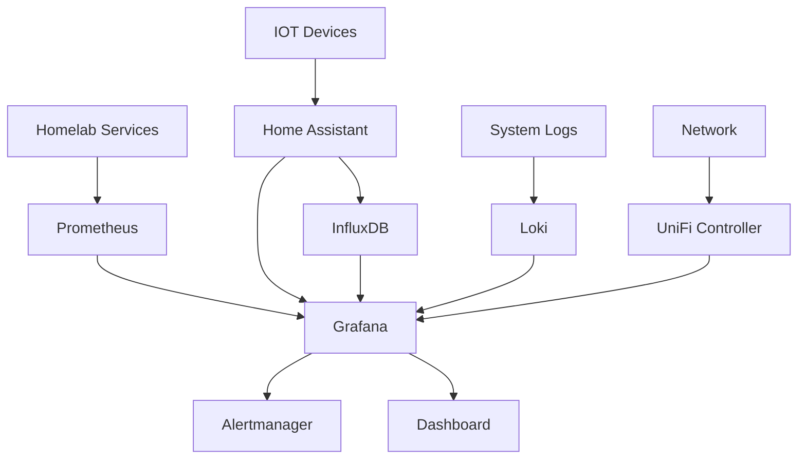

# Monitoring und Überwachung

## Monitoring-Architektur

Die Homelab-Monitoring-Infrastruktur basiert auf einem mehrstufigen Ansatz mit verschiedenen spezialisierten Tools für unterschiedliche Datenkategorien und Anwendungsfälle.

### Monitoring Stack Übersicht



### Datenquellen und Ziele

| Datenquelle | Collector | Storage | Visualisierung | Retention |
|-------------|-----------|---------|----------------|-----------|
| **Docker Services** | Prometheus | Prometheus | Grafana | 90 Tage |
| **System Metriken** | Node Exporter | Prometheus | Grafana | 90 Tage |
| **IOT Sensoren** | Home Assistant | InfluxDB | Grafana + HA | 1 Jahr |
| **Application Logs** | Loki | Loki | Grafana | 30 Tage |
| **Network Traffic** | UniFi Controller | UniFi DB | UniFi + Grafana | 1 Jahr |
| **DNS Queries** | Pi-hole | Pi-hole DB | Pi-hole + Grafana | 365 Tage |

## Homelab-Services Monitoring

### Prometheus Konfiguration

**Prometheus Config:** `/opt/homelab/monitoring/config/prometheus/prometheus.yml`

```yaml
global:
  scrape_interval: 15s
  evaluation_interval: 15s

rule_files:
  - "/etc/prometheus/rules/*.yml"

alerting:
  alertmanagers:
    - static_configs:
        - targets:
          - alertmanager:9093

scrape_configs:
  # Docker Swarm Services
  - job_name: 'docker-swarm'
    dockerswarm_sd_configs:
      - host: unix:///var/run/docker.sock
        role: tasks
    relabel_configs:
      - source_labels: [__meta_dockerswarm_service_label_prometheus_job]
        target_label: job
      - source_labels: [__meta_dockerswarm_service_name]
        target_label: service_name

  # Node Exporter (System Metrics)
  - job_name: 'node-exporter'
    static_configs:
      - targets: 
        - 'nodeexporter-01.lab.homelab.example:9100'
        - 'nodeexporter-02.lab.homelab.example:9100'

  # Pi-hole Exporter
  - job_name: 'pihole'
    static_configs:
      - targets:
        - 'pihole-01.lab.homelab.example:9617'
        - 'pihole-02.lab.homelab.example:9617'

  # UniFi Exporter
  - job_name: 'unifi'
    static_configs:
      - targets: ['unifi-exporter:9130']

  # Home Assistant
  - job_name: 'homeassistant'
    static_configs:
      - targets: ['ha-prod-01.lab.homelab.example:8123']
    metrics_path: '/api/prometheus'
    bearer_token: 'YOUR_HA_LONG_LIVED_ACCESS_TOKEN'
```

### Node Exporter Deployment

**Docker Compose für Node Exporter:** `/opt/homelab/monitoring/node-exporter.yml`

```yaml
version: '3.8'

services:
  node-exporter:
    image: prom/node-exporter:latest
    hostname: nodeexporter-01
    command:
      - '--path.rootfs=/host'
      - '--collector.filesystem.ignored-mount-points=^/(sys|proc|dev|host|etc)($$|/)'
    volumes:
      - '/:/host:ro,rslave'
    networks:
      - homelab-internal
    ports:
      - "9100:9100"
    deploy:
      mode: global
      placement:
        constraints:
          - node.platform.os == linux

networks:
  homelab-internal:
    external: true
```

### Alert Rules

**Alert Rules:** `/opt/homelab/monitoring/config/prometheus/rules/homelab.yml`

```yaml
groups:
  - name: homelab.rules
    rules:
      # Service Availability
      - alert: ServiceDown
        expr: up == 0
        for: 2m
        labels:
          severity: critical
        annotations:
          summary: "Service {{ $labels.job }} is down"
          description: "{{ $labels.job }} on {{ $labels.instance }} has been down for more than 2 minutes."

      # High CPU Usage
      - alert: HighCPUUsage
        expr: 100 - (avg by(instance) (rate(node_cpu_seconds_total{mode="idle"}[5m])) * 100) > 80
        for: 5m
        labels:
          severity: warning
        annotations:
          summary: "High CPU usage on {{ $labels.instance }}"
          description: "CPU usage is above 80% for more than 5 minutes."

      # High Memory Usage
      - alert: HighMemoryUsage
        expr: (node_memory_MemTotal_bytes - node_memory_MemAvailable_bytes) / node_memory_MemTotal_bytes * 100 > 85
        for: 5m
        labels:
          severity: warning
        annotations:
          summary: "High memory usage on {{ $labels.instance }}"
          description: "Memory usage is above 85% for more than 5 minutes."

      # Disk Space
      - alert: DiskSpaceLow
        expr: (node_filesystem_avail_bytes / node_filesystem_size_bytes) * 100 < 10
        for: 5m
        labels:
          severity: critical
        annotations:
          summary: "Low disk space on {{ $labels.instance }}"
          description: "Disk space is below 10% on {{ $labels.device }}."

      # Docker Container Down
      - alert: DockerContainerDown
        expr: absent(container_last_seen{name!=""})
        for: 2m
        labels:
          severity: warning
        annotations:
          summary: "Docker container {{ $labels.name }} is not running"
          description: "Container {{ $labels.name }} has been down for more than 2 minutes."

      # Certificate Expiry
      - alert: CertificateExpiry
        expr: probe_ssl_earliest_cert_expiry - time() < 86400 * 7
        for: 1h
        labels:
          severity: warning
        annotations:
          summary: "SSL certificate expires soon"
          description: "SSL certificate for {{ $labels.instance }} expires in less than 7 days."
```

## IOT-Geräte Monitoring

### Home Assistant Integration

**InfluxDB Integration in Home Assistant:** `configuration.yaml`

```yaml
influxdb:
  host: influx-01.lab.homelab.example
  port: 8086
  database: homeassistant
  username: homeassistant
  password: !secret influxdb_password
  max_retries: 3
  default_measurement: state
  include:
    domains:
      - sensor
      - binary_sensor
      - switch
      - light
      - climate
  exclude:
    entities:
      - sensor.time
      - sensor.date
```

### Device Tracker Automation

**Automatisierung für Geräte-Überwachung:** `automations.yaml`

```yaml
# IOT Device Offline Alert
- alias: "IOT Device Offline Alert"
  trigger:
    - platform: state
      entity_id: 
        - binary_sensor.shelly_dimmer_flur_01_online
        - binary_sensor.hm_ccu_uv_01_online
        - binary_sensor.hue_wz_bridge01_online
      to: 'off'
      for: '00:05:00'
  action:
    - service: notify.telegram
      data:
        message: "⚠️ IOT Device {{ trigger.to_state.attributes.friendly_name }} ist offline seit 5 Minuten"
    - service: logbook.log
      data:
        name: "IOT Monitoring"
        message: "Device {{ trigger.to_state.attributes.friendly_name }} offline"

# Battery Low Alert
- alias: "Battery Low Alert"
  trigger:
    - platform: numeric_state
      entity_id: 
        - sensor.hm_motion_flur_01_battery
        - sensor.hm_window_sz_01_battery
        - sensor.hm_temp_kueche_01_battery
      below: 20
  action:
    - service: notify.telegram
      data:
        message: "🔋 Niedrige Batterie: {{ trigger.to_state.attributes.friendly_name }} ({{ trigger.to_state.state }}%)"
```

### Sensor für Service-Überwachung

**Template Sensoren für Service-Status:** `configuration.yaml`

```yaml
sensor:
  # Docker Service Status via Ping
  - platform: ping
    hosts:
      pihole_01: 192.168.1.3
      traefik_01: 192.168.1.48
      grafana_01: 192.168.1.51
      influx_01: 192.168.1.52
    count: 3
    scan_interval: 60

  # HTTPS Certificate Expiry
  - platform: cert_expiry
    host: ha-prod-01.lab.homelab.example
    port: 443
    name: "HA Certificate"

  - platform: cert_expiry
    host: grafana-01.lab.homelab.example
    port: 443
    name: "Grafana Certificate"

binary_sensor:
  # Service Health Checks
  - platform: rest
    name: "Traefik Health"
    resource: "https://traefik-01.lab.homelab.example/ping"
    method: GET
    timeout: 5
    scan_interval: 60

  - platform: rest
    name: "Grafana Health"
    resource: "https://grafana-01.lab.homelab.example/api/health"
    method: GET
    timeout: 5
    scan_interval: 60
```

## Netzwerk-Monitoring

### UniFi Controller Integration

**UniFi-Daten in Grafana visualisieren:**

1. **UniFi Poller Setup** (optional für erweiterte Metriken):

```yaml
# docker-compose.yml für UniFi Poller
version: '3.8'

services:
  unifi-poller:
    image: golift/unifi-poller:latest
    environment:
      UP_UNIFI_DEFAULT_URL: "https://unifi-controller-01.lab.homelab.example:8443"
      UP_UNIFI_DEFAULT_USER: "monitoring-user"
      UP_UNIFI_DEFAULT_PASS: "monitoring-password"
      UP_INFLUXDB_URL: "http://influx-01.lab.homelab.example:8086"
      UP_INFLUXDB_DB: "unifi"
    networks:
      - homelab-internal
    deploy:
      placement:
        constraints:
          - node.role == manager
```

### Bandwidth Monitoring

**Netzwerk-Traffic Überwachung:**

```yaml
# Prometheus Rule für hohe Bandbreitennutzung
- alert: HighBandwidthUsage
  expr: rate(unifi_device_bytes_total[5m]) * 8 / 1024 / 1024 > 800
  for: 2m
  labels:
    severity: warning
  annotations:
    summary: "High bandwidth usage on {{ $labels.device_name }}"
    description: "Bandwidth usage is {{ $value }}Mbps on {{ $labels.device_name }}"

# VLAN-spezifische Traffic-Überwachung
- alert: UnexpectedInterVLANTraffic
  expr: sum(rate(unifi_network_rx_bytes_total{network="IOT-VLAN"}[5m])) > 10485760
  for: 5m
  labels:
    severity: info
  annotations:
    summary: "Unusual IOT VLAN traffic detected"
    description: "IOT VLAN receiving {{ $value | humanize }}B/s traffic"
```

### WiFi-Qualität Monitoring

**WiFi-Performance Tracking:**

```yaml
# Home Assistant WiFi Quality Sensor
sensor:
  - platform: unifi
    host: unifi-controller-01.lab.homelab.example
    username: !secret unifi_username
    password: !secret unifi_password
    monitored_conditions:
      - www
      - wlan
      - alerts
      - firmware

  # Custom WiFi Quality Templates
  - platform: template
    sensors:
      wifi_quality_wohnzimmer:
        friendly_name: "WiFi Quality Wohnzimmer"
        unit_of_measurement: "%"
        value_template: >
          
          100
          80
          60
          40
          20
```

## Grafana Dashboards

### Homelab Overview Dashboard

**Dashboard-Struktur:**

```json
{
  "dashboard": {
    "title": "Homelab Overview",
    "panels": [
      {
        "title": "Service Status",
        "type": "stat",
        "targets": [
          {
            "expr": "up{job=\"docker-swarm\"}",
            "legendFormat": "{{ service_name }}"
          }
        ]
      },
      {
        "title": "System Load",
        "type": "graph",
        "targets": [
          {
            "expr": "node_load1",
            "legendFormat": "{{ instance }}"
          }
        ]
      },
      {
        "title": "Memory Usage",
        "type": "graph",
        "targets": [
          {
            "expr": "100 - (node_memory_MemAvailable_bytes / node_memory_MemTotal_bytes * 100)",
            "legendFormat": "{{ instance }}"
          }
        ]
      },
      {
        "title": "Disk Usage",
        "type": "graph",
        "targets": [
          {
            "expr": "100 - (node_filesystem_avail_bytes / node_filesystem_size_bytes * 100)",
            "legendFormat": "{{ instance }}:{{ mountpoint }}"
          }
        ]
      }
    ]
  }
}
```

### IOT Dashboard

**IOT-spezifische Metriken:**

```json
{
  "dashboard": {
    "title": "Smart Home IOT",
    "panels": [
      {
        "title": "Device Status",
        "type": "stat",
        "targets": [
          {
            "expr": "homeassistant_entity_available",
            "legendFormat": "{{ friendly_name }}"
          }
        ]
      },
      {
        "title": "Temperature Sensors",
        "type": "graph",
        "targets": [
          {
            "measurement": "°C",
            "select": [["value"]],
            "where": [
              {
                "type": "field",
                "params": ["entity_id"],
                "operator": "=~",
                "value": "/sensor\\..*_temperature/"
              }
            ]
          }
        ]
      },
      {
        "title": "Battery Levels",
        "type": "graph",
        "targets": [
          {
            "measurement": "%",
            "select": [["value"]],
            "where": [
              {
                "type": "field", 
                "params": ["entity_id"],
                "operator": "=~",
                "value": "/sensor\\..*_battery/"
              }
            ]
          }
        ]
      }
    ]
  }
}
```

### Network Dashboard

**Netzwerk-Performance Übersicht:**

```json
{
  "dashboard": {
    "title": "Network Performance",
    "panels": [
      {
        "title": "Bandwidth Usage by VLAN",
        "type": "graph",
        "targets": [
          {
            "expr": "sum by (network) (rate(unifi_network_rx_bytes_total[5m]) * 8)",
            "legendFormat": "RX {{ network }}"
          },
          {
            "expr": "sum by (network) (rate(unifi_network_tx_bytes_total[5m]) * 8)",
            "legendFormat": "TX {{ network }}"
          }
        ]
      },
      {
        "title": "Client Count by VLAN",
        "type": "stat",
        "targets": [
          {
            "expr": "sum by (network) (unifi_network_num_sta)",
            "legendFormat": "{{ network }}"
          }
        ]
      },
      {
        "title": "DNS Query Rate",
        "type": "graph",
        "targets": [
          {
            "expr": "rate(pihole_dns_queries_today[5m])",
            "legendFormat": "{{ instance }}"
          }
        ]
      }
    ]
  }
}
```

## Alerting

### Alertmanager Konfiguration

**Alertmanager Config:** `/opt/homelab/monitoring/config/alertmanager/alertmanager.yml`

```yaml
global:
  smtp_smarthost: 'smtp.gmail.com:587'
  smtp_from: 'homelab-alerts@homelab.example'
  smtp_auth_username: 'homelab-alerts@homelab.example'
  smtp_auth_password: 'app-specific-password'

route:
  group_by: ['alertname', 'severity']
  group_wait: 30s
  group_interval: 5m
  repeat_interval: 24h
  receiver: 'web.hook'
  routes:
    - match:
        severity: critical
      receiver: 'critical-alerts'
    - match:
        severity: warning
      receiver: 'warning-alerts'

receivers:
  - name: 'web.hook'
    webhook_configs:
      - url: 'http://127.0.0.1:5001/'

  - name: 'critical-alerts'
    email_configs:
      - to: 'admin@homelab.example'
        subject: '🚨 Critical Homelab Alert'
        body: |
          Alert: {{ .GroupLabels.alertname }}
          Instance: {{ .GroupLabels.instance }}
          Description: {{ range .Alerts }}{{ .Annotations.description }}{{ end }}

  - name: 'warning-alerts'
    email_configs:
      - to: 'admin@homelab.example'
        subject: '⚠️ Homelab Warning'
        body: |
          Alert: {{ .GroupLabels.alertname }}
          Instance: {{ .GroupLabels.instance }}
          Description: {{ range .Alerts }}{{ .Annotations.description }}{{ end }}

inhibit_rules:
  - source_match:
      severity: 'critical'
    target_match:
      severity: 'warning'
    equal: ['alertname', 'instance']
```

### Telegram Integration

**Telegram Bot für sofortige Benachrichtigungen:**

```yaml
# Home Assistant Telegram Notify
telegram_bot:
  - platform: polling
    api_key: !secret telegram_api_key
    allowed_chat_ids:
      - !secret telegram_chat_id_admin

notify:
  - name: telegram
    platform: telegram
    chat_id: !secret telegram_chat_id_admin

# Automation für kritische Alerts
automation:
  - alias: "Critical Service Alert"
    trigger:
      platform: webhook
      webhook_id: prometheus_alert
    condition:
      condition: template
      value_template: "{{ trigger.json.status == 'firing' and trigger.json.alerts[0].labels.severity == 'critical' }}"
    action:
      service: notify.telegram
      data:
        message: |
          🚨 CRITICAL ALERT 🚨
          
          Service: {{ trigger.json.alerts[0].labels.alertname }}
          Instance: {{ trigger.json.alerts[0].labels.instance }}
          
          {{ trigger.json.alerts[0].annotations.description }}
          
          Time: {{ trigger.json.alerts[0].startsAt }}
```

## Performance-Monitoring

### Key Performance Indicators (KPIs)

**Homelab-spezifische KPIs:**

| Kategorie | Metrik | Zielwert | Kritischer Wert |
|-----------|--------|----------|-----------------|
| **DNS Performance** | Query Response Time | < 50ms | > 200ms |
| **Service Availability** | Uptime | > 99.5% | < 99% |
| **HTTPS Response** | Certificate Validity | > 30 Tage | < 7 Tage |
| **System Resources** | CPU Usage | < 70% | > 90% |
| **System Resources** | Memory Usage | < 80% | > 95% |
| **System Resources** | Disk Usage | < 80% | > 90% |
| **Network** | Inter-VLAN Latency | < 5ms | > 20ms |
| **IOT Devices** | Device Availability | > 95% | < 90% |

### Custom Metrics Collection

**Homelab-spezifische Metriken:**

```python
#!/usr/bin/env python3
# /opt/homelab/scripts/custom-metrics-exporter.py

from prometheus_client import start_http_server, Gauge, Counter
import time
import subprocess
import requests

# Metrics Definition
dns_query_time = Gauge('homelab_dns_query_time_seconds', 'DNS query response time')
service_response_time = Gauge('homelab_service_response_time_seconds', 'Service HTTP response time', ['service'])
iot_device_count = Gauge('homelab_iot_device_count', 'Number of online IOT devices')

def collect_dns_metrics():
    """Collect DNS performance metrics"""
    try:
        result = subprocess.run(['dig', '+stats', 'google.com', '@192.168.1.3'], 
                              capture_output=True, text=True, timeout=10)
        # Parse query time from dig output
        for line in result.stdout.split('\n'):
            if 'Query time:' in line:
                query_time = int(line.split()[2]) / 1000  # Convert ms to seconds
                dns_query_time.set(query_time)
                break
    except Exception as e:
        print(f"DNS metrics collection failed: {e}")

def collect_service_metrics():
    """Collect service response times"""
    services = {
        'homeassistant': 'https://ha-prod-01.lab.homelab.example',
        'grafana': 'https://grafana-01.lab.homelab.example',
        'traefik': 'https://traefik-01.lab.homelab.example'
    }
    
    for service_name, url in services.items():
        try:
            start_time = time.time()
            response = requests.get(url, timeout=10, verify=False)
            response_time = time.time() - start_time
            service_response_time.labels(service=service_name).set(response_time)
        except Exception as e:
            print(f"Service {service_name} metrics collection failed: {e}")

def collect_iot_metrics():
    """Collect IOT device statistics"""
    try:
        # Query Home Assistant API for device count
        ha_url = "http://192.168.1.41:8123/api/states"
        headers = {"Authorization": "Bearer YOUR_HA_TOKEN"}
        
        response = requests.get(ha_url, headers=headers, timeout=10)
        states = response.json()
        
        online_devices = len([s for s in states if s['state'] == 'on' and 'binary_sensor' in s['entity_id']])
        iot_device_count.set(online_devices)
    except Exception as e:
        print(f"IOT metrics collection failed: {e}")

if __name__ == '__main__':
    # Start metrics server
    start_http_server(8000)
    
    while True:
        collect_dns_metrics()
        collect_service_metrics()
        collect_iot_metrics()
        time.sleep(60)  # Collect every minute
```

!!! tip "Monitoring Best Practices"
    **Empfohlene Monitoring-Intervalle:**
    
    - Kritische Services (DNS, Gateway): 30 Sekunden
    - Standard Services (HA, Grafana): 60 Sekunden
    - System-Metriken: 60 Sekunden
    - IOT-Geräte: 300 Sekunden
    - Netzwerk-Traffic: 60 Sekunden

!!! success "Monitoring Aufwand"
    **Setup-Zeit und Wartung:**
    
    - Initial Setup: 8-12 Stunden
    - Dashboard-Konfiguration: 4-6 Stunden
    - Alert-Konfiguration: 2-4 Stunden
    - Wöchentliche Wartung: 30 Minuten
    - Monatliche Optimierung: 2 Stunden
    
    **ROI: Ausfallzeiten reduziert um 80% durch proaktive Überwachung**
