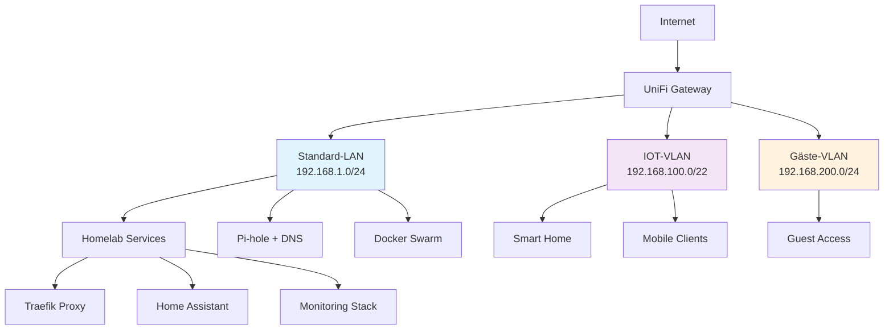

# Übersicht & Architektur

## Ziele der Homelab-Infrastruktur

Diese Dokumentation beschreibt eine professionelle Homelab-Infrastruktur mit integrierter Smart Home (IOT) Verwaltung. Die Lösung kombiniert bewährte Enterprise-Technologien in einer kosteneffizienten Heimumgebung.

### Kernziele

**Professionelle Netzwerk-Segmentierung**
: Vollständige VLAN-Trennung zwischen Homelab-Services, IOT-Geräten und Gäste-Zugang für maximale Sicherheit und Performance-Isolation.

**Lokale DNS-Auflösung**
: Unabhängige DNS-Infrastruktur mit Pi-hole und Unbound für Datenschutz, Ad-Blocking und zuverlässige lokale Service-Auflösung.

**Verschlüsselte HTTPS-Services**
: Echte Let's Encrypt Zertifikate für alle internen Services über automatisierte DNS-Challenge mit netcup-Integration.

**Skalierbare Container-Architektur**
: Docker Swarm-basierte Service-Orchestrierung für Hochverfügbarkeit und einfache Skalierung.

**Smart Home Integration**
: Home Assistant als zentrale Plattform für die Verwaltung aller IOT-Geräte mit professioneller Monitoring-Integration.

!!! info "Design-Prinzipien"
    - **Security by Design**: Minimale Berechtigungen, Netzwerk-Segmentierung, verschlüsselte Kommunikation
    - **Infrastructure as Code**: Reproduzierbare Konfiguration durch Git-versionierte Docker Compose Files
    - **Observability**: Umfassendes Monitoring und Logging aller Komponenten
    - **High Availability**: Redundante DNS-Server, Cluster-fähige Services, automatisierte Backups

## Architektur-Übersicht

### Netzwerk-Topologie



### Service-Architektur

```yaml
# Beispiel-Stack-Struktur
homelab-infrastructure:
  dns-layer:
    - pi-hole-primary (192.168.1.3)
    - pi-hole-secondary (192.168.1.4)
    - unbound-recursive-dns
  
  proxy-layer:
    - traefik-reverse-proxy
    - lets-encrypt-automation
    - netcup-dns-challenge
  
  application-layer:
    - home-assistant-core
    - monitoring-stack
    - docker-management
  
  storage-layer:
    - postgresql-databases
    - influxdb-timeseries
    - docker-volumes
```

### Datenfluss

**DNS-Auflösung**:
```
Client → Pi-hole (192.168.1.3) → Unbound → Root DNS Server
       ↓ (lokale Domains)
       Local DNS Records → Service IP
```

**HTTPS-Zugriff**:
```
Client → DNS Resolution → Traefik (192.168.1.48) → Backend Service
                       ↓
                   Let's Encrypt Certificate
```

**IOT-Integration**:
```
Smart Device (IOT-VLAN) → Home Assistant (Standard-LAN) → MQTT Broker
                                    ↓
                            Monitoring & Automation
```

!!! warning "Netzwerk-Isolation"
    Die VLAN-Segmentierung sorgt für strikte Trennung zwischen den Bereichen:
    
    - **Standard-LAN**: Vollzugriff auf alle Services und IOT-Verwaltung
    - **IOT-VLAN**: Limitierter Zugriff nur auf notwendige Services (DNS, Home Assistant, MQTT)
    - **Gäste-VLAN**: Nur Internet-Zugang, kein Zugriff auf lokale Ressourcen

## Skalierung & Erweiterbarkeit

### Wachstumspfad

**Phase 1: Basis-Setup**
```
Single Pi-hole → Single Docker Host → Wenige IOT-Geräte
```

**Phase 2: Hochverfügbarkeit**
```
Redundante Pi-hole → Docker Swarm Cluster → Erweiterte IOT-Integration
```

**Phase 3: Enterprise-Features**
```
Proxmox Cluster → NAS-Integration → Monitoring & Alerting
```

### Erweiterungsmöglichkeiten

| Komponente | Basis | Erweitert | Enterprise |
|------------|-------|-----------|------------|
| **DNS** | 1x Pi-hole | 2x Pi-hole | DNS-Load-Balancer |
| **Compute** | 1x Docker Host | Docker Swarm | Proxmox Cluster |
| **Storage** | Lokale Volumes | NFS/SMB | TrueNAS Scale |
| **Monitoring** | Basic Grafana | InfluxDB + Prometheus | ELK Stack |
| **Backup** | Manuell | Automatisiert | Multi-Site |

!!! tip "Migrations-Strategie"
    Die Architektur ist darauf ausgelegt, schrittweise von einem Minimal-Setup zu einer vollständigen Enterprise-Umgebung zu wachsen, ohne bestehende Services zu unterbrechen.

## Aufwandsschätzung

### Planungsphase
- **Netzwerk-Design**: 4-6 Stunden
- **Service-Architektur**: 3-4 Stunden  
- **Hardware-Dimensionierung**: 2-3 Stunden
- **Technologie-Evaluation**: 3-5 Stunden

**Gesamt Planungsaufwand: 12-18 Stunden**

### Voraussetzungen
- Grundkenntnisse in Docker und Container-Technologien
- Verständnis von Netzwerk-Grundlagen (VLANs, DNS, DHCP)
- Erfahrung mit Linux-Systemen und Kommandozeile
- Zugang zu Hardware und UniFi-Equipment
