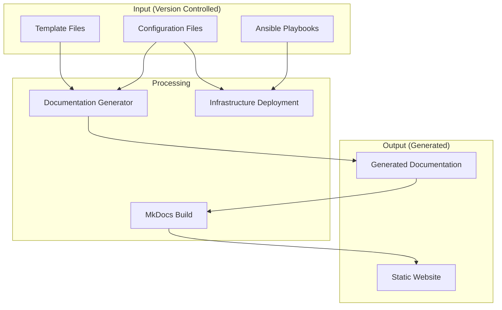

# 🏗️ Architecture Documentation

> **Technical design and implementation details for the homelab template system**

## 🎯 Design Philosophy

This homelab system is built around the principle of **separation of concerns**:

- **Templates** contain structure and example data (publicly shareable)
- **Configuration** contains real data (private/environment-specific)  
- **Generator** combines templates + config = personalized documentation
- **Automation** deploys the actual infrastructure

This approach allows for:
- **Public sharing** of templates without exposing sensitive data
- **Environment isolation** (dev/test/prod configurations)
- **Consistent documentation** that stays in sync with infrastructure
- **Collaborative development** of templates and automation

## 📁 Repository Structure

### Complete Directory Layout

```
homelab/                          # Main consolidated repository
├── templates/                    # Template documentation with placeholders
│   ├── docs/                     # Markdown templates (*.md.j2)
│   │   ├── index.md.j2           # Main documentation index
│   │   ├── infrastructure/       # Infrastructure documentation
│   │   │   ├── dns.md.j2         # DNS server documentation
│   │   │   ├── proxy.md.j2       # Reverse proxy documentation
│   │   │   └── ssl.md.j2         # SSL certificate management
│   │   ├── network/              # Network documentation
│   │   │   ├── basics.md.j2      # Basic network configuration
│   │   │   ├── vlans.md.j2       # VLAN setup and management
│   │   │   └── unifi.md.j2       # UniFi equipment documentation
│   │   ├── services/             # Service-specific documentation
│   │   │   ├── homeassistant.md.j2  # Home Assistant setup
│   │   │   ├── monitoring.md.j2     # Monitoring stack (Prometheus/Grafana)
│   │   │   └── management.md.j2     # Management tools (Portainer, etc.)
│   │   └── automation/           # Automation documentation
│   │       ├── ansible-overview.md.j2  # Ansible automation overview
│   │       └── roles/            # Role-specific documentation
│   ├── assets/                   # Static assets
│   │   ├── images/               # Template images and diagrams
│   │   ├── stylesheets/          # Custom CSS
│   │   └── javascript/           # Custom JavaScript
│   ├── mkdocs.yml.j2             # MkDocs configuration template
│   └── README.md.j2              # Repository README template
├── ansible/                      # Infrastructure automation (migrated from Infrastructure/Ansible)
│   ├── inventories/              # Environment-specific inventories
│   │   ├── production/           # Production environment
│   │   │   ├── hosts.yml         # Production hosts
│   │   │   └── group_vars/       # Production-specific variables
│   │   ├── test/                 # Test environment
│   │   └── development/          # Development environment
│   ├── playbooks/                # Ansible playbooks
│   │   ├── site.yml              # Main site deployment
│   │   ├── docker-install.yml    # Docker installation
│   │   ├── pihole-deploy.yml     # Pi-hole deployment
│   │   ├── traefik-deploy.yml    # Traefik deployment
│   │   └── monitoring-deploy.yml # Monitoring stack deployment
│   ├── roles/                    # Reusable Ansible roles
│   │   ├── docker/               # Docker installation and configuration
│   │   ├── pihole/               # Pi-hole DNS server
│   │   ├── traefik/              # Traefik reverse proxy
│   │   ├── monitoring/           # Prometheus/Grafana monitoring
│   │   └── security/             # Security hardening (fail2ban, UFW)
│   └── group_vars/               # Global Ansible variables
│       ├── all.yml               # Variables for all hosts
│       └── docker_hosts.yml      # Docker-specific variables
├── scripts/                      # Automation and build scripts
│   ├── setup/                    # Initial setup scripts
│   │   ├── setup-environment.sh  # Python environment setup
│   │   └── migrate-from-repos.sh # Migration from existing repositories
│   ├── generator/                # Documentation generator
│   │   ├── generate-docs.py      # Main documentation generator
│   │   ├── validate-config.py    # Configuration validation
│   │   └── templates/            # Generator-specific templates
│   │       └── generators/       # Code generation templates
│   ├── build/                    # Build and deployment scripts
│   │   ├── develop.sh            # Development server with live reload
│   │   ├── build.sh              # Production build
│   │   └── deploy.sh             # Deployment to various targets
│   └── maintenance/              # Maintenance scripts
│       └── update-ansible-docs.py # Auto-update Ansible role documentation
├── config-example/               # Example configuration (safe to share publicly)
│   ├── environments/             # Environment-specific overrides
│   │   ├── production.yml        # Production environment settings
│   │   ├── test.yml              # Test environment settings
│   │   └── development.yml       # Development environment settings
│   ├── network.yml               # Network configuration template
│   ├── services.yml              # Service definitions template
│   ├── infrastructure.yml        # Hardware specifications template
│   └── documentation.yml         # Documentation metadata template
├── docs/                         # Generated final documentation (gitignored)
├── site/                         # Built website output (gitignored)
├── requirements.txt              # Python dependencies
├── .env.example                  # Environment variables template
├── .gitignore                    # Git ignore patterns
└── README.md                     # Main project documentation

homelab-config/                   # Optional separate configuration repository
├── environments/                 # Environment-specific configurations
│   ├── production.yml            # Production overrides
│   ├── test.yml                  # Test overrides
│   └── development.yml           # Development overrides
├── network.yml                   # Real network configuration
├── services.yml                  # Real service definitions
├── infrastructure.yml            # Real hardware specifications
├── secrets.yml                   # Sensitive data (gitignored)
└── documentation.yml             # Documentation customization
```

### Directory Purposes

| Directory | Purpose | Shareable | Content Type |
|-----------|---------|-----------|--------------|
| `templates/` | Documentation templates with example data | ✅ Public | Jinja2 templates |
| `ansible/` | Infrastructure automation code | ✅ Public | Ansible playbooks/roles |
| `scripts/` | Build and automation scripts | ✅ Public | Python/Bash scripts |
| `config-example/` | Example configuration files | ✅ Public | YAML configuration |
| `docs/` | Generated documentation | ❌ Generated | Markdown files |
| `site/` | Built website | ❌ Generated | Static HTML/CSS/JS |
| `homelab-config/` | Real configuration data | 🔒 Private | YAML configuration |

## 🔧 Template System Architecture

### Template Processing Flow



### Template Engine: Jinja2

The system uses Jinja2 templating engine with the following features:

#### Variable Substitution
```jinja2
# Template: templates/docs/index.md.j2
# Welcome to {{ site.name | default("My Homelab") }}

# Configuration: config-local/documentation.yml
site:
  name: "John's Homelab"

# Generated: docs/index.md
# Welcome to John's Homelab
```

#### Conditional Rendering
```jinja2

- **Pi-hole:** [{{ services.pihole.host }}](http://{{ services.pihole.host }})

```

#### Loop Processing
```jinja2

| {{ vlan_config.vlan_id }} | {{ vlan_name | title }} | {{ vlan_config.subnet }} |

```

#### Filters and Functions
```jinja2
{{ service_name | title }}              # Capitalize first letter
{{ service_config.description | default("No description") }}  # Default values
{{ ansible_date_time.iso8601 }}         # Current timestamp
```

## ⚙️ Configuration System Architecture

### Configuration Hierarchy

The configuration system supports multiple layers with override precedence:

1. **Base configuration** (`config-*/network.yml`, `services.yml`, etc.)
2. **Environment overrides** (`config-*/environments/production.yml`)
3. **Runtime overrides** (environment variables)

```yaml
# Example configuration merge:
# Base: config-local/services.yml
services:
  pihole:
    enabled: true
    host: "pihole.lab.local"

# Environment: config-local/environments/production.yml  
services:
  pihole:
    host: "pihole.example.com"  # Overrides base configuration

# Result: pihole.enabled=true, pihole.host="pihole.example.com"
```

### Configuration Structure

#### Core Configuration Files

| File | Purpose | Required Fields |
|------|---------|-----------------|
| `network.yml` | Network topology and addressing | `domain.internal`, `networks` |
| `services.yml` | Service definitions and endpoints | `services` |
| `infrastructure.yml` | Hardware and server specifications | `servers` |
| `documentation.yml` | Documentation metadata and branding | `site.name` |

#### Environment Configuration Files

| Environment | Use Case | Override Examples |
|-------------|----------|-------------------|
| `production.yml` | Live infrastructure | Real domain names, production IPs |
| `test.yml` | Testing and staging | Test domain, isolated networks |
| `development.yml` | Development work | Local overrides, debug settings |

### Configuration Validation

The system includes comprehensive configuration validation:

```python
# Validation rules from scripts/generator/generate-docs.py
required_fields = [
    "domain.internal",      # Internal domain name
    "networks",             # Network definitions
    "services"              # Service configurations
]

# Network validation
network_validation = [
    "vlan_id must be integer between 1-4094",
    "subnet must be valid CIDR notation",
    "gateway must be valid IP address"
]

# Service validation
service_validation = [
    "enabled must be boolean",
    "host must be valid FQDN or IP",
    "port must be integer between 1-65535"
]
```

## 🐍 Documentation Generator Architecture

### Generator Components

#### Main Generator Class
```python
class HomeLabDocGenerator:
    def __init__(self, project_root: Path, config_path: Path = None):
        self.project_root = project_root
        self.config_path = config_path or project_root / "config-example"
        self.templates_dir = project_root / "templates"
        self.output_dir = project_root / "docs"
        
        # Jinja2 Environment with custom configuration
        self.env = Environment(
            loader=FileSystemLoader(str(self.templates_dir)),
            trim_blocks=True,      # Remove newlines after template tags
            lstrip_blocks=True     # Remove whitespace before template tags
        )
```

#### Configuration Loading
```python
def load_config(self) -> Dict[str, Any]:
    """Load and merge configuration files with environment overrides"""
    
    # 1. Load base configuration files
    config_files = ["network.yml", "services.yml", "infrastructure.yml", "documentation.yml"]
    combined_config = {}
    
    for config_file in config_files:
        file_path = self.config_path / config_file
        if file_path.exists():
            with open(file_path, 'r', encoding='utf-8') as f:
                section_config = yaml.safe_load(f)
                if section_config:
                    combined_config.update(section_config)
    
    # 2. Apply environment-specific overrides
    env_name = os.getenv('HOMELAB_ENV', 'production')
    env_file = self.config_path / "environments" / f"{env_name}.yml"
    
    if env_file.exists():
        with open(env_file, 'r', encoding='utf-8') as f:
            env_config = yaml.safe_load(f)
            if env_config:
                self._deep_merge(combined_config, env_config)
    
    return combined_config
```

#### Template Processing
```python
def _render_template_file(self, template_file: Path, output_file: Path) -> None:
    """Render a single template file with configuration data"""
    try:
        # Get relative path for Jinja2 loader
        relative_path = template_file.relative_to(self.templates_dir)
        
        # Load template and render with configuration
        template = self.env.get_template(str(relative_path))
        rendered_content = template.render(
            config=self.config,
            **self.config  # Make all config keys available as direct variables
        )
        
        # Write output
        with open(output_file, 'w', encoding='utf-8') as f:
            f.write(rendered_content)
            
    except Exception as e:
        print(f"❌ Error rendering {template_file}: {e}")
```

### Build Pipeline Architecture

#### Development Pipeline
```bash
# Development workflow with live reload
scripts/build/develop.sh
├── Load configuration
├── Generate documentation
├── Start MkDocs development server
└── Watch for changes and regenerate
```

#### Production Pipeline
```bash
# Production build pipeline
scripts/build/build.sh  
├── Validate configuration
├── Generate documentation
├── Build static website
└── Optimize for deployment
```

#### Deployment Pipeline
```bash
# Deployment pipeline
scripts/build/deploy.sh
├── Build production site
├── Deploy to target (GitHub Pages, S3, etc.)
└── Update DNS/CDN if needed
```

## 🤖 Ansible Integration Architecture

### Ansible Structure

#### Inventory Management
```yaml
# inventories/production/hosts.yml
all:
  children:
    docker_hosts:
      hosts:
        homelab-services:
          ansible_host: 192.168.10.101
          ansible_user: admin
    
    unifi_controllers:
      hosts:
        unifi-controller:
          ansible_host: 192.168.10.5
```

#### Role Architecture
```
roles/docker/
├── defaults/main.yml     # Default variables
├── tasks/main.yml        # Main installation tasks
├── handlers/main.yml     # Service handlers (restart, reload)
├── templates/            # Configuration file templates
│   └── docker-compose.yml.j2
├── files/                # Static files
└── meta/main.yml         # Role metadata and dependencies
```

#### Playbook Organization
```yaml
# playbooks/site.yml - Main deployment playbook
---
- name: Install Docker on all docker hosts
  hosts: docker_hosts
  roles:
    - docker

- name: Deploy core services
  hosts: docker_hosts
  roles:
    - pihole
    - traefik
    - monitoring

- name: Configure security
  hosts: all
  roles:
    - security
```

### Documentation Integration

The system automatically updates Ansible documentation:

```python
# scripts/maintenance/update-ansible-docs.py
def update_role_documentation():
    """Auto-generate role documentation from Ansible metadata"""
    
    for role_path in Path("ansible/roles").iterdir():
        if role_path.is_dir():
            # Read role metadata
            meta_file = role_path / "meta" / "main.yml"
            if meta_file.exists():
                # Generate documentation template
                doc_template = f"templates/docs/automation/roles/{role_path.name}.md.j2"
                generate_role_template(role_path, doc_template)
```

## 🔒 Security Architecture

### Sensitive Data Management

#### Data Classification
- **Public data:** Templates, example configurations, Ansible playbooks
- **Internal data:** Real network configurations, service definitions
- **Secret data:** Passwords, API keys, certificates

#### Storage Strategy
```
├── homelab/                    # Public repository
│   ├── templates/              # ✅ Safe to share publicly
│   ├── ansible/                # ✅ Safe to share (no secrets)
│   └── config-example/         # ✅ Example data only
├── homelab-config/             # Private repository
│   ├── network.yml             # 🔒 Real network information
│   ├── services.yml            # 🔒 Real service configurations
│   └── secrets.yml             # 🔒 Encrypted secrets (ansible-vault)
```

#### Secret Management
```bash
# Encrypt sensitive data with ansible-vault
ansible-vault encrypt config-private/secrets.yml

# Use encrypted secrets in playbooks
vars_files:
  - "{{ config_path }}/secrets.yml"
```

## 🔄 Environment Management

### Multi-Environment Support

#### Environment Isolation
```bash
# Production environment
HOMELAB_ENV=production HOMELAB_CONFIG_PATH=./config-production ./scripts/build/build.sh

# Test environment  
HOMELAB_ENV=test HOMELAB_CONFIG_PATH=./config-test ./scripts/build/develop.sh

# Development environment
HOMELAB_ENV=development HOMELAB_CONFIG_PATH=./config-local ./scripts/build/develop.sh
```

#### Configuration Inheritance
```yaml
# Base configuration: config-production/services.yml
services:
  pihole:
    enabled: true
    host: "pihole.lab.local"
    ip: "192.168.10.10"

# Environment override: config-production/environments/production.yml
services:
  pihole:
    host: "pihole.example.com"  # Production domain
    
# Result: Production uses pihole.example.com, other settings inherited
```

## 🚀 Migration Architecture

### Migration from Existing Repositories

#### Automated Migration Process
```bash
# Migration script: scripts/setup/migrate-from-repos.sh
migrate_infrastructure_repo() {
    local source_repo="$1"
    
    # 1. Migrate Ansible code
    if [[ -d "$source_repo/Ansible" ]]; then
        cp -r "$source_repo/Ansible"/* "$PROJECT_ROOT/ansible/"
    fi
    
    # 2. Convert concept documents to templates
    if [[ -d "$source_repo/Concept" ]]; then
        for file in "$source_repo/Concept"/*.md; do
            convert_to_template "$file" "$PROJECT_ROOT/templates/docs/planning/"
        done
    fi
}

migrate_docs_repo() {
    local source_repo="$1"
    
    # 1. Convert existing docs to templates
    find "$source_repo/docs" -name "*.md" | while read -r file; do
        convert_to_template "$file" "$PROJECT_ROOT/templates/docs/"
    done
    
    # 2. Convert MkDocs configuration to template
    cp "$source_repo/mkdocs.yml" "$PROJECT_ROOT/templates/mkdocs.yml.j2"
}
```

#### Template Conversion Process
```bash
convert_to_template() {
    local source_file="$1"
    local target_dir="$2"
    
    # Extract hardcoded values and replace with template variables
    sed -i 's/lab\.local/{{ domain.internal }}/g' "$source_file"
    sed -i 's/192\.168\.10\./{{ networks.management.subnet | replace("\/24", "") | replace("0", "") }}/g' "$source_file"
    
    # Add template extension
    cp "$source_file" "$target_dir/$(basename "$source_file").j2"
}
```

## 🧪 Testing Architecture

### Testing Strategy

#### Unit Tests
```python
# tests/unit/test_generator.py
def test_configuration_loading():
    """Test configuration file loading and merging"""
    generator = HomeLabDocGenerator(test_project_root)
    config = generator.load_config()
    
    assert "domain" in config
    assert "networks" in config
    assert "services" in config

def test_template_rendering():
    """Test template rendering with test data"""
    template_content = "Welcome to {{ site.name }}"
    rendered = render_template(template_content, {"site": {"name": "Test Lab"}})
    
    assert rendered == "Welcome to Test Lab"
```

#### Integration Tests
```python
# tests/integration/test_full_pipeline.py
def test_complete_documentation_generation(tmp_path):
    """Test complete documentation generation workflow"""
    
    # Setup test environment
    setup_test_config(tmp_path)
    
    # Run generator
    generator = HomeLabDocGenerator(tmp_path)
    generator.load_config()
    generator.generate_docs()
    
    # Verify output
    assert (tmp_path / "docs" / "index.md").exists()
    assert (tmp_path / "mkdocs.yml").exists()
    
    # Test MkDocs build
    result = subprocess.run(["mkdocs", "build"], cwd=tmp_path)
    assert result.returncode == 0
```

#### Ansible Testing
```yaml
# roles/docker/molecule/default/molecule.yml
dependency:
  name: galaxy
driver:
  name: docker
platforms:
  - name: instance
    image: ubuntu:20.04
    pre_build_image: true
provisioner:
  name: ansible
verifier:
  name: ansible
```

## 📊 Performance Architecture

### Optimization Strategies

#### Build Performance
- **Template caching:** Cache rendered templates between builds
- **Parallel processing:** Process multiple templates simultaneously  
- **Incremental builds:** Only rebuild changed files
- **Asset optimization:** Compress images and optimize CSS/JS

#### Runtime Performance
- **Static site generation:** Pre-built HTML for fast loading
- **CDN integration:** Serve assets from CDN
- **Image optimization:** WebP format with fallbacks
- **Lazy loading:** Load content on demand

### Monitoring and Metrics

```python
# Performance monitoring in generator
import time
from functools import wraps

def measure_performance(func):
    @wraps(func)
    def wrapper(*args, **kwargs):
        start_time = time.time()
        result = func(*args, **kwargs)
        end_time = time.time()
        
        print(f"⏱️ {func.__name__}: {end_time - start_time:.2f}s")
        return result
    return wrapper

@measure_performance
def generate_docs(self):
    # Documentation generation with timing
    pass
```

## 🔮 Future Architecture Considerations

### Planned Enhancements

#### Advanced Template Features
- **Conditional sections:** Show/hide documentation sections based on configuration
- **Dynamic diagrams:** Generate network diagrams from configuration
- **Interactive content:** JavaScript-enhanced documentation with real-time data

#### Enhanced Automation
- **GitOps integration:** Automatic deployment on configuration changes
- **Health monitoring:** Automated infrastructure health checks
- **Backup automation:** Scheduled backups with restoration testing

#### Scalability Improvements
- **Distributed builds:** Build documentation across multiple environments
- **Plugin system:** Extensible architecture for community contributions
- **API integration:** REST API for configuration management

---

This architecture provides a robust foundation for maintaining homelab infrastructure and documentation while supporting collaboration, security, and scalability requirements.
