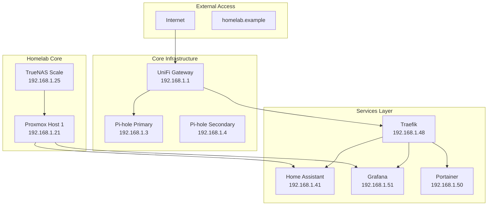

# Standard-LAN Inventar

Das Standard-LAN (192.168.1.0/24) bildet das Rückgrat der Homelab-Infrastruktur und beherbergt alle kritischen Management- und Service-Komponenten. Diese Dokumentation erfasst alle Geräte mit ihren IP-Adressen, DNS-Namen und Zugriffsmöglichkeiten.

## Netzwerk-Übersicht

```yaml
VLAN: Default/1 (Untagged)
Subnetz: 192.168.1.0/24
Gateway: 192.168.1.1
DNS-Server: 192.168.1.3, 192.168.1.4
Domain: lab.homelab.example
```

!!! info "IP-Adressierung"
    Das Standard-LAN verwendet eine strukturierte IP-Vergabe zur optimalen Organisation und Skalierbarkeit:
    
    - **Core Infrastructure:** .2 - .20 (UniFi, DNS, Switching)
    - **Homelab Core:** .21 - .40 (Proxmox, Storage) 
    - **Homelab Services:** .41 - .99 (Docker, Applications)
    - **DHCP Pool:** .100 - .200 (Automatische Zuweisung)
    - **Client Devices:** .201 - .220 (Management-Clients)

## Core Infrastructure (192.168.1.2 - 192.168.1.20)

### UniFi Management

| Gerät | IP | DNS-Name | Öffentlicher Zugang | Funktion |
|-------|----|---------|--------------------|----------|
| **UniFi Controller** | 192.168.1.2 | unifi-controller-01.lab.homelab.example | https://unifi-controller-01.lab.homelab.example:8443 | Zentrale Netzwerkverwaltung |
| **UniFi Switch Main** | 192.168.1.10 | switch-main-01.lab.homelab.example | - | Hauptswitch Arbeitszimmer |
| **UniFi AP Wohnzimmer** | 192.168.1.11 | ap-wz-01.lab.homelab.example | - | Access Point Wohnzimmer |
| **UniFi AP Schlafzimmer** | 192.168.1.12 | ap-sz-01.lab.homelab.example | - | Access Point Schlafzimmer |

### DNS-Infrastruktur

| Gerät | IP | DNS-Name | Öffentlicher Zugang | Funktion |
|-------|----|---------|--------------------|----------|
| **Pi-hole Primary** | 192.168.1.3 | pihole-01.lab.homelab.example | https://pihole-01.lab.homelab.example | DNS + Ad-Blocking + Unbound |
| **Pi-hole Secondary** | 192.168.1.4 | pihole-02.lab.homelab.example | https://pihole-02.lab.homelab.example | Redundante DNS (optional) |

!!! warning "Kritische Infrastruktur"
    Die DNS-Server sind essentiell für den Betrieb aller Services. Bei Ausfall sind alle HTTPS-Dienste über DNS-Namen nicht mehr erreichbar.

### Technische Spezifikationen

#### UniFi Controller
```yaml
Hardware: VM oder dedizierte Hardware
CPU: 2 vCPU / 4 Cores
RAM: 4 GB
Storage: 50 GB SSD
OS: Ubuntu Server 22.04 LTS
Software: UniFi Network Application 8.x
```

#### Pi-hole Hosts
```yaml
Hardware: Raspberry Pi 4B (4GB)
Storage: 256 GB SSD via USB 3.0
OS: Raspberry Pi OS Lite 64-bit
Container: Docker + Docker Compose
Services: Pi-hole, Unbound, Traefik
```

## Homelab Core (192.168.1.21 - 192.168.1.40)

### Virtualisierung & Storage

| Gerät | IP | DNS-Name | Öffentlicher Zugang | Spezifikation | Funktion |
|-------|----|---------|--------------------|---------------|----------|
| **Proxmox Host 1** | 192.168.1.21 | pve-01.lab.homelab.example | https://pve-01.lab.homelab.example:8006 | 32GB RAM, 1TB NVMe | Hauptserver |
| **Proxmox Host 2** | 192.168.1.22 | pve-02.lab.homelab.example | https://pve-02.lab.homelab.example:8006 | 16GB RAM, 500GB SSD | Backup/Cluster (optional) |
| **TrueNAS Scale** | 192.168.1.25 | nas-01.lab.homelab.example | https://nas-01.lab.homelab.example | 16GB RAM, 4x4TB RAID-Z1 | Zentraler Storage |

### Hardware-Details

#### Proxmox Host 1 (Produktiv)
```yaml
CPU: Intel i7-12700K / AMD Ryzen 7 5700G
RAM: 32 GB DDR4-3200
Storage Boot: 256 GB NVMe SSD
Storage VMs: 1 TB NVMe SSD
Storage Backup: 2 TB SATA SSD
Netzwerk: 2x Gigabit Ethernet
```

#### TrueNAS Scale (Storage)
```yaml
CPU: Intel i5-10400 / AMD Ryzen 5 3600
RAM: 16 GB DDR4 ECC (empfohlen)
Storage: 4x 4TB WD Red (RAID-Z1)
Cache: 256 GB NVMe SSD
Netzwerk: 2x Gigabit Ethernet (LACP)
```

!!! tip "Skalierungsoptionen"
    - **Single-Host Setup:** Proxmox Host 1 reicht für die meisten Anwendungsfälle
    - **Cluster Setup:** Host 2 für Hochverfügbarkeit und Live-Migration
    - **Storage-Alternative:** Lokale SSDs statt zentralem NAS für bessere Performance

## Homelab Services (192.168.1.41 - 192.168.1.99)

### Smart Home & IOT

| Service | IP | DNS-Name | Öffentlicher Zugang | Container | Funktion |
|---------|----|---------|--------------------|-----------|----------|
| **Home Assistant Prod** | 192.168.1.41 | ha-prod-01.lab.homelab.example | https://ha-prod-01.lab.homelab.example | Docker | Produktiv HA Instance |
| **Home Assistant Test** | 192.168.1.42 | ha-test-01.lab.homelab.example | - | Docker | Test/Development |
| **MQTT Broker** | 192.168.1.55 | mqtt-01.lab.homelab.example | - | Mosquitto | IOT Messaging |

### Container-Orchestrierung

| Service | IP | DNS-Name | Öffentlicher Zugang | Typ | Funktion |
|---------|----|---------|--------------------|-----|----------|
| **Docker Swarm Manager** | 192.168.1.45 | docker-01.lab.homelab.example | - | Host | Swarm Leader |
| **Docker Swarm Worker 1** | 192.168.1.46 | docker-02.lab.homelab.example | - | Host | Swarm Worker (optional) |
| **Docker Swarm Worker 2** | 192.168.1.47 | docker-03.lab.homelab.example | - | Host | Swarm Worker (optional) |

### Reverse Proxy & Management

| Service | IP | DNS-Name | Öffentlicher Zugang | Container | Funktion |
|---------|----|---------|--------------------|-----------|----------|
| **Traefik Reverse Proxy** | 192.168.1.48 | traefik-01.lab.homelab.example | https://traefik-01.lab.homelab.example | Docker | SSL-Terminierung |
| **Portainer** | 192.168.1.50 | portainer-01.lab.homelab.example | https://portainer-01.lab.homelab.example | Docker | Docker Management |

### Monitoring & Observability

| Service | IP | DNS-Name | Öffentlicher Zugang | Container | Funktion |
|---------|----|---------|--------------------|-----------|----------|
| **Grafana** | 192.168.1.51 | grafana-01.lab.homelab.example | https://grafana-01.lab.homelab.example | Docker | Dashboard |
| **InfluxDB** | 192.168.1.52 | influx-01.lab.homelab.example | - | Docker | Time Series DB |
| **Prometheus** | 192.168.1.56 | prometheus-01.lab.homelab.example | - | Docker | Metrics Collection |
| **Node Exporter** | 192.168.1.57 | nodeexp-01.lab.homelab.example | - | Docker | System Metrics |
| **Loki** | 192.168.1.58 | loki-01.lab.homelab.example | - | Docker | Log Aggregation |
| **Jaeger** | 192.168.1.59 | jaeger-01.lab.homelab.example | - | Docker | Distributed Tracing |

### Service-Architektur



### Erweiterungsmöglichkeiten

**Verfügbare IP-Adressen:**
```yaml
192.168.1.60-99: 40 weitere Service-IPs verfügbar
Mögliche Services:
  - GitLab/Gitea (Code-Repository)
  - NextCloud (File-Sharing)
  - Bitwarden (Password Manager)
  - Jellyfin (Media Server)
  - Prometheus Exporters
  - zusätzliche Monitoring-Tools
```

## Client Devices (192.168.1.201 - 192.168.1.220)

### Management-Clients

| Gerät | IP | DNS-Name | Zugriff | Funktion |
|-------|----|---------|---------|---------| 
| **Admin Desktop** | 192.168.1.205 | desktop-admin-01.lab.homelab.example | Kabelgebunden | Management PC |
| **Admin Laptop** | 192.168.1.206 | laptop-admin-01.lab.homelab.example | WiFi "Enzian" | Mobile Management |
| **Drucker** | 192.168.1.210 | printer-01.lab.homelab.example | WiFi "Enzian" | Netzwerkdrucker |

### Reservierte Adressen

```yaml
192.168.1.211-220: 10 weitere Client-IPs verfügbar
Verwendung:
  - Weitere Laptops/Desktops
  - Test-Geräte
  - Gäste mit privilegiertem Zugang
  - IoT-Management-Geräte
```

!!! note "Zugriffsprivilegien"
    Geräte im Standard-LAN haben vollständigen Zugriff auf alle Homelab-Services und können als Sprungbrett ins IOT-VLAN verwendet werden.

## DNS-Konfiguration

### Pi-hole Lokale DNS-Einträge

```bash
# Core Infrastructure
192.168.1.2    unifi-controller-01.lab.homelab.example
192.168.1.3    pihole-01.lab.homelab.example
192.168.1.4    pihole-02.lab.homelab.example

# Homelab Core
192.168.1.21   pve-01.lab.homelab.example
192.168.1.22   pve-02.lab.homelab.example
192.168.1.25   nas-01.lab.homelab.example

# Homelab Services
192.168.1.41   ha-prod-01.lab.homelab.example
192.168.1.48   traefik-01.lab.homelab.example
192.168.1.50   portainer-01.lab.homelab.example
192.168.1.51   grafana-01.lab.homelab.example
```

### Wildcard-Konfiguration

```bash
# /etc/dnsmasq.d/02-lab-wildcard.conf
address=/lab.homelab.example/192.168.1.48

# Alle *.lab.homelab.example Anfragen werden zu Traefik geleitet
# Traefik routet basierend auf Host-Header zu entsprechenden Services
```

### DNS-Test-Kommandos

```bash
# Lokale Auflösung testen
nslookup ha-prod-01.lab.homelab.example 192.168.1.3
dig @192.168.1.3 ha-prod-01.lab.homelab.example

# Wildcard-Auflösung testen
nslookup test.lab.homelab.example 192.168.1.3
dig @192.168.1.3 test.lab.homelab.example

# Externe Auflösung über Unbound testen
nslookup google.com 192.168.1.3
```

## Wartung & Dokumentation

### Automatisierte Inventarisierung

```bash
#!/bin/bash
# scan-standard-lan.sh

echo "Standard-LAN Inventar Scan"
echo "=========================="

# Ping-Sweep für aktive Geräte
for i in {1..254}; do
    ip="192.168.1.$i"
    ping -c 1 -W 1 "$ip" &>/dev/null && echo "✓ $ip aktiv"
done

# Detaillierte Geräte-Information
nmap -sn 192.168.1.0/24 | grep -E "Nmap scan report|MAC Address"

# DNS-Auflösung für dokumentierte Geräte
while IFS= read -r hostname; do
    ip=$(dig +short "$hostname" @192.168.1.3)
    echo "$hostname -> $ip"
done < standard-lan-hostnames.txt
```

### Backup-Relevante Systeme

!!! danger "Kritische Systeme"
    Diese Systeme müssen regelmäßig gesichert werden:
    
    - **Pi-hole Konfiguration:** DNS-Einträge, Blocklists, Einstellungen
    - **UniFi Controller:** Netzwerkkonfiguration, Geräte-Settings
    - **Proxmox:** VM-Konfigurationen, Snapshots
    - **TrueNAS:** Datasets, Konfiguration, Snapshots
    - **Docker Stacks:** Compose-Files, Volumes, Configs

### Monitoring-Integration

```yaml
# Grafana Dashboard Metriken
Standard-LAN Monitoring:
  - Geräteverfügbarkeit (Ping)
  - Service-Status (HTTP Health Checks)  
  - Netzwerk-Traffic (SNMP)
  - DNS-Query-Performance
  - SSL-Zertifikat-Gültigkeit
  - Docker-Container-Status
```

## Aufwandsschätzung

| Aktivität | Zeitaufwand | Häufigkeit |
|-----------|-------------|------------|
| **Initiale Einrichtung** | 8-12 Stunden | Einmalig |
| **DNS-Einträge pflegen** | 15 Minuten | Bei neuen Services |
| **Inventar aktualisieren** | 30 Minuten | Monatlich |
| **Health-Check durchführen** | 20 Minuten | Wöchentlich |
| **Backup-Verification** | 45 Minuten | Monatlich |
| **Hardware-Wartung** | 2-4 Stunden | Halbjährlich |

**Gesamtaufwand:** ~2-3 Stunden/Monat für Betrieb und Wartung des Standard-LANs.
