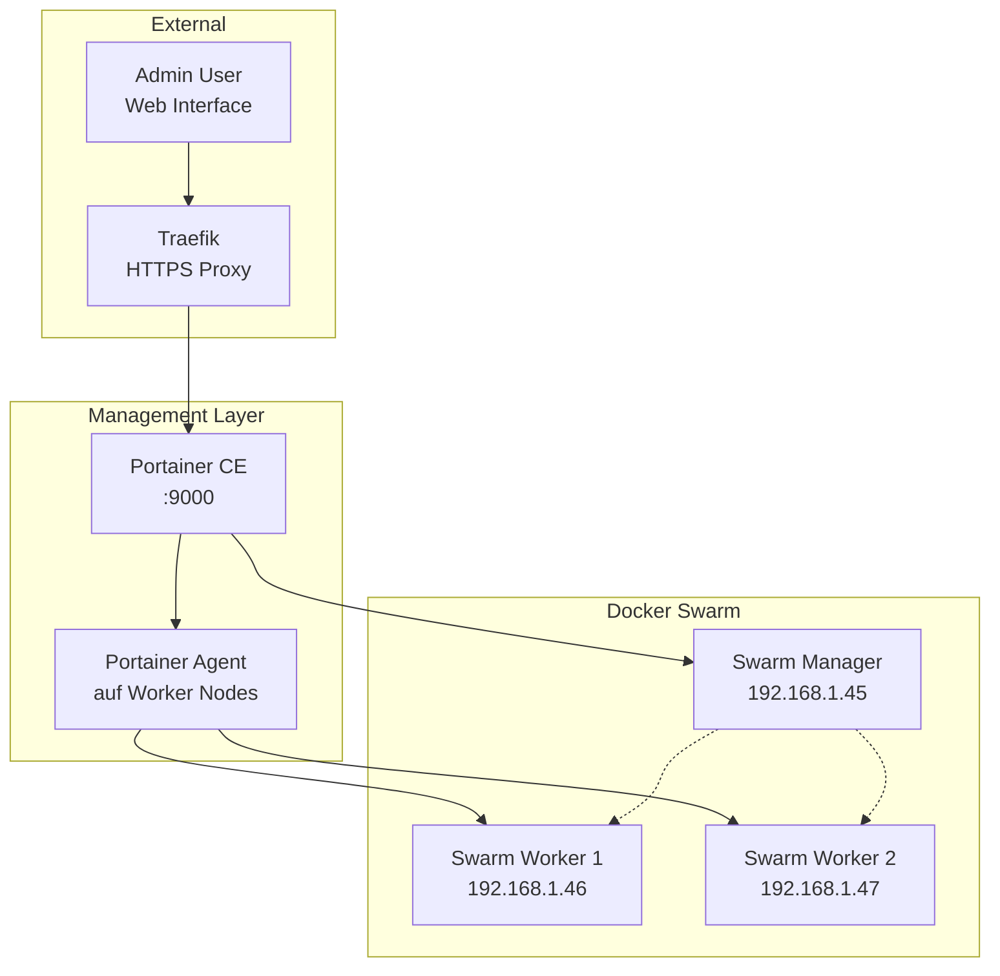

# Management Services

Management-Services bilden die administrative Schicht des Homelabs und ermöglichen die zentrale Verwaltung aller Container, Volumes und Netzwerke. Portainer dient als Haupt-Management-Interface, ergänzt durch spezialisierte Tools für verschiedene Administrations-Aufgaben.

## Portainer Stack

Portainer bietet eine Web-basierte Oberfläche für Docker Swarm Management und vereinfacht die Administration komplexer Container-Umgebungen erheblich.

### Architektur-Übersicht



## Docker Compose Konfiguration

```yaml title="/opt/homelab/portainer/docker-compose.yml"
version: '3.8'

services:
  portainer:
    image: portainer/portainer-ce:${PORTAINER_VERSION}
    hostname: portainer-01
    command: 
      - -H
      - unix:///var/run/docker.sock
      - --admin-password-file
      - /run/secrets/portainer_admin_password
    environment:
      TZ: "${TZ}"
    volumes:
      - /var/run/docker.sock:/var/run/docker.sock
      - portainer_data:/data
    networks:
      - traefik
      - homelab-internal
    secrets:
      - portainer_admin_password
    labels:
      - "traefik.enable=true"
      - "traefik.http.routers.portainer.rule=Host(`portainer-01.lab.enzmann.online`)"
      - "traefik.http.routers.portainer.tls.certresolver=letsencrypt"
      - "traefik.http.services.portainer.loadbalancer.server.port=9000"
      - "homelab.service.name=portainer"
      - "homelab.service.category=management"
    deploy:
      placement:
        constraints:
          - node.role == manager
      replicas: 1

  # Portainer Agent für Worker Nodes
  agent:
    image: portainer/agent:${PORTAINER_AGENT_VERSION}
    environment:
      AGENT_CLUSTER_ADDR: tasks.agent
      TZ: "${TZ}"
    volumes:
      - /var/run/docker.sock:/var/run/docker.sock
      - /var/lib/docker/volumes:/var/lib/docker/volumes
    networks:
      - homelab-internal
    deploy:
      mode: global
      placement:
        constraints:
          - node.platform.os == linux

volumes:
  portainer_data:

secrets:
  portainer_admin_password:
    external: true

networks:
  traefik:
    external: true
  homelab-internal:
    external: true
```

### Environment-Konfiguration

```bash title="/opt/homelab/portainer/.env.example"
# Portainer Configuration
PORTAINER_VERSION=latest
PORTAINER_AGENT_VERSION=latest
TZ=Europe/Berlin

# Admin Configuration
PORTAINER_ADMIN_USER=admin
PORTAINER_ADMIN_PASSWORD=CHANGE_ME_TO_SECURE_PORTAINER_PASSWORD
```

### Secret Management

```bash title="Portainer Admin Secret erstellen"
# Admin-Passwort als Docker Secret erstellen
echo "your-secure-admin-password" | docker secret create portainer_admin_password -

# Secret-Status prüfen
docker secret ls
docker secret inspect portainer_admin_password
```

## Initial Setup

### Docker Swarm Vorbereitung

```bash
# Falls Swarm noch nicht initialisiert
docker swarm init --advertise-addr 192.168.1.45

# Erforderliche Networks erstellen
docker network create --driver overlay traefik
docker network create --driver overlay homelab-internal

# Worker Nodes hinzufügen (auf jedem Worker ausführen)
docker swarm join --token SWMTKN-... 192.168.1.45:2377
```

### Portainer Deployment

```bash
# In Portainer-Verzeichnis wechseln
cd /opt/homelab/portainer

# Environment-Setup
cp .env.example .env
nano .env  # Passwort anpassen

# Admin-Secret erstellen
echo "your-secure-admin-password" | docker secret create portainer_admin_password -

# Stack deployen
docker stack deploy -c docker-compose.yml portainer

# Status prüfen
docker service ls
docker service ps portainer_portainer
```

### Erste Anmeldung

1. **Web-Interface öffnen:** https://portainer-01.lab.enzmann.online
2. **Admin-User anlegen:** (Passwort aus .env verwenden)
3. **Environment auswählen:** "Docker Swarm" 
4. **Endpoint konfigurieren:** Lokaler Docker Socket bereits verbunden

## Management-Features

### Container-Management

**Service-Übersicht:**
- **Stack-Verwaltung:** Deployment und Management mehrerer Services
- **Service-Skalierung:** Replica-Anzahl dynamisch anpassen
- **Rolling Updates:** Zero-Downtime Updates durchführen
- **Log-Aggregation:** Centralized Logging aller Container

**Volume-Management:**
- **Backup-Erstellung:** Volume-Snapshots über UI
- **Cleanup:** Verwaiste Volumes identifizieren und entfernen
- **Monitoring:** Volume-Usage und Performance überwachen

### Network-Management

```yaml title="Netzwerk-Konfiguration über Portainer"
# Overlay-Networks für Service-Kommunikation
networks:
  traefik:
    driver: overlay
    external: true
    
  homelab-internal:
    driver: overlay
    internal: true
    external: true
    
  monitoring:
    driver: overlay
    internal: true
```

### User & Access Management

**Teams und Rollen:**

```yaml title="Portainer Access Control"
# Team-Konfiguration
teams:
  homelab-admins:
    role: administrator
    members:
      - admin
      - homelab-user
      
  monitoring-viewers:
    role: read-only
    resources:
      - monitoring-stack
      - grafana-service
      
  iot-managers:
    role: operator
    resources:
      - homeassistant-stack
      - mqtt-services
```

## Erweiterte Management-Tools

### Watchtower - Automatische Updates

```yaml title="Watchtower für automatische Container-Updates"
version: '3.8'

services:
  watchtower:
    image: containrrr/watchtower:${WATCHTOWER_VERSION}
    hostname: watchtower-01
    environment:
      TZ: "${TZ}"
      WATCHTOWER_SCHEDULE: "0 0 4 * * SUN"  # Sonntag 04:00
      WATCHTOWER_CLEANUP: "true"
      WATCHTOWER_INCLUDE_RESTARTING: "true"
      WATCHTOWER_NOTIFICATIONS: "email"
      WATCHTOWER_NOTIFICATION_EMAIL_FROM: "watchtower@enzmann.online"
      WATCHTOWER_NOTIFICATION_EMAIL_TO: "admin@enzmann.online"
    volumes:
      - /var/run/docker.sock:/var/run/docker.sock
    networks:
      - homelab-internal
    labels:
      - "homelab.service.name=watchtower"
      - "homelab.service.category=management"
    deploy:
      placement:
        constraints:
          - node.role == manager
```

### Dozzle - Live Log Viewer

```yaml title="Dozzle für Live-Container-Logs"
version: '3.8'

services:
  dozzle:
    image: amir20/dozzle:${DOZZLE_VERSION}
    hostname: dozzle-01
    environment:
      DOZZLE_LEVEL: info
      DOZZLE_TAILSIZE: 300
    volumes:
      - /var/run/docker.sock:/var/run/docker.sock:ro
    networks:
      - traefik
    labels:
      - "traefik.enable=true"
      - "traefik.http.routers.dozzle.rule=Host(`logs-01.lab.enzmann.online`)"
      - "traefik.http.routers.dozzle.tls.certresolver=letsencrypt"
      - "traefik.http.services.dozzle.loadbalancer.server.port=8080"
      - "homelab.service.name=dozzle"
      - "homelab.service.category=management"
    deploy:
      mode: global
```

### Diun - Docker Image Update Notifier

```yaml title="Diun für Update-Benachrichtigungen"
version: '3.8'

services:
  diun:
    image: crazymax/diun:${DIUN_VERSION}
    hostname: diun-01
    environment:
      TZ: "${TZ}"
      LOG_LEVEL: "info"
    volumes:
      - diun_data:/data
      - /var/run/docker.sock:/var/run/docker.sock:ro
      - ./config/diun.yml:/diun.yml:ro
    networks:
      - homelab-internal
    labels:
      - "homelab.service.name=diun"
      - "homelab.service.category=management"
    deploy:
      placement:
        constraints:
          - node.role == manager

volumes:
  diun_data:
```

### Docker Registry - Private Image Storage

```yaml title="Private Docker Registry"
version: '3.8'

services:
  registry:
    image: registry:${REGISTRY_VERSION}
    hostname: registry-01
    environment:
      REGISTRY_STORAGE_FILESYSTEM_ROOTDIRECTORY: /data
      REGISTRY_HTTP_ADDR: "0.0.0.0:5000"
      REGISTRY_AUTH: htpasswd
      REGISTRY_AUTH_HTPASSWD_REALM: "Registry Realm"
      REGISTRY_AUTH_HTPASSWD_PATH: /auth/htpasswd
    volumes:
      - registry_data:/data
      - ./config/registry/auth:/auth
    networks:
      - traefik
    labels:
      - "traefik.enable=true"
      - "traefik.http.routers.registry.rule=Host(`registry-01.lab.enzmann.online`)"
      - "traefik.http.routers.registry.tls.certresolver=letsencrypt"
      - "traefik.http.services.registry.loadbalancer.server.port=5000"
      - "homelab.service.name=registry"
      - "homelab.service.category=management"
    deploy:
      placement:
        constraints:
          - node.role == manager

volumes:
  registry_data:
```

## Backup & Recovery Management

### Automated Stack Backups

```bash title="/opt/homelab/scripts/backup-docker-stacks.sh"
#!/bin/bash

# Docker Stack Backup Script
BACKUP_DIR="/opt/homelab/backup/stacks"
DATE=$(date +%Y%m%d-%H%M)

mkdir -p "$BACKUP_DIR"

# Stack-Konfigurationen sichern
echo "📋 Backup Docker Stack Configurations..."
tar czf "$BACKUP_DIR/stack-configs-$DATE.tar.gz" \
    /opt/homelab/*/docker-compose.yml \
    /opt/homelab/*/.env.example \
    --exclude=/opt/homelab/backup \
    --exclude=/opt/homelab/secrets

# Volume-Daten sichern
echo "💾 Backup Docker Volumes..."
docker run --rm \
    -v /var/lib/docker/volumes:/source:ro \
    -v "$BACKUP_DIR":/backup \
    alpine tar czf "/backup/docker-volumes-$DATE.tar.gz" -C /source .

# Portainer-spezifische Daten
echo "🔧 Backup Portainer Data..."
docker run --rm \
    -v portainer_portainer_data:/source:ro \
    -v "$BACKUP_DIR":/backup \
    alpine tar czf "/backup/portainer-data-$DATE.tar.gz" -C /source .

# Swarm-Konfiguration exportieren
echo "🐝 Export Swarm Configuration..."
docker node ls --format "table {{.Hostname}}\t{{.Status}}\t{{.Availability}}\t{{.ManagerStatus}}" > "$BACKUP_DIR/swarm-nodes-$DATE.txt"
docker service ls --format "table {{.Name}}\t{{.Mode}}\t{{.Replicas}}\t{{.Image}}" > "$BACKUP_DIR/swarm-services-$DATE.txt"

echo "✅ Docker Stack Backup completed: $BACKUP_DIR/"
```

### Stack Recovery Script

```bash title="/opt/homelab/scripts/restore-docker-stacks.sh"
#!/bin/bash

# Docker Stack Recovery Script
RESTORE_DATE=${1:-"latest"}
BACKUP_DIR="/opt/homelab/backup/stacks"

if [ "$RESTORE_DATE" = "latest" ]; then
    RESTORE_FILE=$(ls -t $BACKUP_DIR/stack-configs-*.tar.gz | head -n1)
    VOLUME_FILE=$(ls -t $BACKUP_DIR/docker-volumes-*.tar.gz | head -n1)
else
    RESTORE_FILE="$BACKUP_DIR/stack-configs-$RESTORE_DATE.tar.gz"
    VOLUME_FILE="$BACKUP_DIR/docker-volumes-$RESTORE_DATE.tar.gz"
fi

echo "🔄 Restoring Docker Stacks from: $RESTORE_FILE"

# Services stoppen
echo "⏹️  Stopping all stacks..."
docker stack ls --format "{{.Name}}" | xargs -r docker stack rm
sleep 30

# Volumes wiederherstellen
echo "💾 Restoring Docker Volumes..."
docker run --rm \
    -v /var/lib/docker/volumes:/target \
    -v "$BACKUP_DIR":/backup \
    alpine tar xzf "/backup/$(basename $VOLUME_FILE)" -C /target

# Stack-Konfigurationen wiederherstellen
echo "📋 Restoring Stack Configurations..."
tar xzf "$RESTORE_FILE" -C /

# Services neu starten
echo "🚀 Redeploying stacks..."
cd /opt/homelab

# Networks erstellen
docker network create --driver overlay traefik || true
docker network create --driver overlay homelab-internal || true

# Secrets wiederherstellen (manuell)
echo "🔐 Please recreate Docker secrets manually:"
echo "  docker secret create portainer_admin_password -"

# Stacks nacheinander deployen
for stack in traefik portainer dns-stack homeassistant monitoring; do
    if [ -d "$stack" ]; then
        echo "Deploying $stack..."
        cd "$stack"
        docker stack deploy -c docker-compose.yml "$stack"
        cd ..
        sleep 10
    fi
done

echo "✅ Docker Stack Recovery completed!"
echo "🔍 Check service status: docker service ls"
```

## Maintenance Tasks

### Health Checks

```bash title="System Health Check Script"
#!/bin/bash

echo "🔍 Homelab Health Check"
echo "======================"

# Docker Swarm Status
echo "🐝 Docker Swarm Status:"
docker node ls
echo ""

# Service Status
echo "📋 Service Status:"
docker service ls
echo ""

# Container Status (nur fehlerhafte)
echo "⚠️ Failed Containers:"
docker ps -a --filter "status=exited" --filter "status=dead"
echo ""

# Volume Usage
echo "💾 Volume Usage:"
docker system df -v | grep -A20 "Local Volumes"
echo ""

# Network Status
echo "🌐 Network Status:"
docker network ls --filter "scope=swarm"
echo ""

# Resource Usage
echo "🖥️ Resource Usage:"
docker stats --no-stream --format "table {{.Container}}\t{{.CPUPerc}}\t{{.MemUsage}}"
echo ""

# Disk Space
echo "💿 Disk Space:"
df -h | grep -E "(/opt/homelab|/var/lib/docker)"
echo ""

# Log Size Check
echo "📝 Large Log Files (>100MB):"
find /var/lib/docker/containers -name "*.log" -size +100M -exec ls -lh {} \;
echo ""

echo "✅ Health Check completed!"
```

### Cleanup Tasks

```bash title="System Cleanup Script"
#!/bin/bash

echo "🧹 Homelab Cleanup"
echo "=================="

# Docker System Prune
echo "🗑️ Cleaning Docker System..."
docker system prune -f --volumes

# Remove unused images
echo "🖼️ Removing unused images..."
docker image prune -a -f

# Clean up log files (älter als 7 Tage)
echo "📝 Cleaning old log files..."
find /var/lib/docker/containers -name "*.log" -mtime +7 -delete

# Remove old backups (älter als 30 Tage)
echo "🗄️ Cleaning old backups..."
find /opt/homelab/backup -name "*.tar.gz" -mtime +30 -delete

# Clean Portainer logs
echo "🔧 Cleaning Portainer logs..."
docker exec $(docker ps -q -f name=portainer) sh -c "find /data/logs -name '*.log' -mtime +7 -delete" 2>/dev/null || true

echo "✅ Cleanup completed!"
echo "💾 New disk usage:"
df -h | grep -E "(/opt/homelab|/var/lib/docker)"
```

## Troubleshooting

### Portainer Issues

**Web-Interface nicht erreichbar:**

```bash
# Service-Status prüfen
docker service ps portainer_portainer

# Logs analysieren
docker service logs portainer_portainer --tail 50

# Traefik-Routing prüfen
curl -k https://traefik-01.lab.enzmann.online/api/http/routers

# Direkter Zugriff (Fallback)
docker ps | grep portainer
docker exec -it <container-id> sh
```

**Agent-Verbindung fehlt:**

```bash
# Agent-Status auf Worker Nodes prüfen
docker service ps portainer_agent

# Node-Verfügbarkeit testen
docker node ls
docker node inspect <node-id>

# Network-Konnektivität
docker exec $(docker ps -q -f name=portainer) nc -zv tasks.agent 9001
```

### Service Management Issues

**Stack-Deployment schlägt fehl:**

```bash
# Stack-Status detailliert prüfen
docker stack ps <stack-name> --no-trunc

# Service-Constraints überprüfen
docker service inspect <service-name> | jq '.[0].Spec.TaskTemplate.Placement'

# Node-Labels setzen (falls erforderlich)
docker node update --label-add role=manager <node-id>
```

**Volume-Mount-Probleme:**

```bash
# Volume-Berechtigungen prüfen
docker volume inspect <volume-name>
ls -la /var/lib/docker/volumes/<volume-name>/_data

# Volume von anderem Container mounten
docker run -it --rm -v <volume-name>:/data alpine sh

# Ownership korrigieren
docker run -it --rm -v <volume-name>:/data alpine chown -R 1000:1000 /data
```

!!! warning "Security Considerations"
    Portainer hat weitreichende Berechtigungen auf dem Docker-Daemon:
    
    - **Zugriffsbeschränkung:** Nur über HTTPS mit starken Passwörtern
    - **Network-Isolation:** Management-Services in separatem VLAN
    - **Regular Updates:** Portainer und Agent regelmäßig aktualisieren
    - **Backup:** Admin-Credentials sicher verwahren

---

**⏱️ Aufwandsschätzung:**

- **Portainer Setup:** 1-2 Stunden
- **Erweiterte Tools:** 2-3 Stunden
- **Backup-System:** 2-3 Stunden
- **Health Monitoring:** 1-2 Stunden
- **Wartung pro Monat:** 2-3 Stunden
