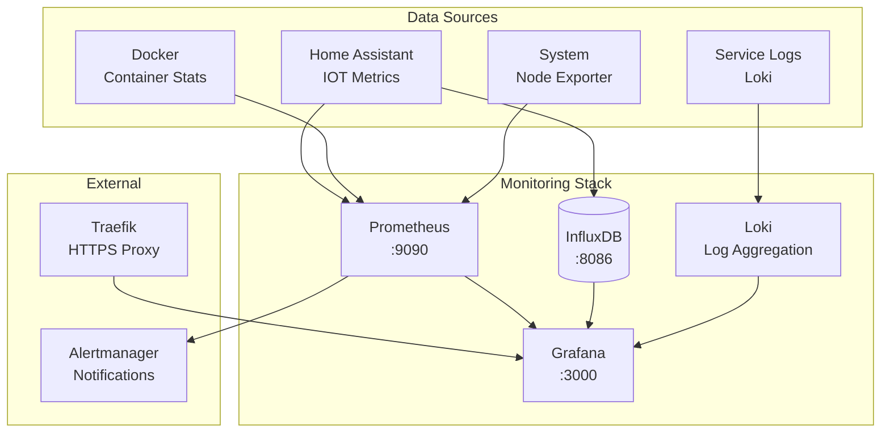

# Monitoring Stack

Das Monitoring-System bietet umfassende Überwachung aller Homelab-Services und IOT-Geräte. Der Stack kombiniert bewährte Open-Source-Tools für Metriken, Logs und Dashboards zu einem integrierten Monitoring-System.

## Architektur-Übersicht



## Service-Komponenten

### Grafana
- **Version:** Latest
- **Port:** 3000 (HTTPS via Traefik)
- **URL:** https://grafana-01.lab.homelab.example
- **Zweck:** Dashboard und Visualisierung

### InfluxDB
- **Version:** 1.8 (Time Series DB)
- **Port:** 8086 (intern)
- **Zweck:** Langzeit-Speicherung für IOT-Metriken

### Prometheus
- **Version:** Latest
- **Port:** 9090 (intern)
- **Zweck:** Metriken-Collection und Alerting

### Loki
- **Version:** Latest
- **Port:** 3100 (intern)
- **Zweck:** Log-Aggregation aller Services

## Docker Compose Konfiguration

```yaml title="/opt/homelab/monitoring/docker-compose.yml"
version: '3.8'

services:
  grafana:
    image: grafana/grafana:${GRAFANA_VERSION}
    hostname: grafana-01
    environment:
      GF_SERVER_ROOT_URL: "https://grafana-01.lab.homelab.example"
      GF_SECURITY_ADMIN_PASSWORD: "${GRAFANA_ADMIN_PASSWORD}"
      GF_INSTALL_PLUGINS: "grafana-clock-panel,grafana-simple-json-datasource,grafana-worldmap-panel"
      GF_SECURITY_ALLOW_EMBEDDING: "true"
      GF_AUTH_ANONYMOUS_ENABLED: "false"
    volumes:
      - grafana_data:/var/lib/grafana
      - ./config/grafana/provisioning:/etc/grafana/provisioning
    networks:
      - traefik
      - homelab-internal
    labels:
      - "traefik.enable=true"
      - "traefik.http.routers.grafana.rule=Host(`grafana-01.lab.homelab.example`)"
      - "traefik.http.routers.grafana.tls.certresolver=letsencrypt"
      - "traefik.http.services.grafana.loadbalancer.server.port=3000"
      - "homelab.service.name=grafana"
      - "homelab.service.category=monitoring"
    deploy:
      placement:
        constraints:
          - node.role == manager

  influxdb:
    image: influxdb:${INFLUXDB_VERSION}
    hostname: influx-01
    environment:
      INFLUXDB_DB: "${INFLUXDB_DATABASE}"
      INFLUXDB_ADMIN_USER: "${INFLUXDB_ADMIN_USER}"
      INFLUXDB_ADMIN_PASSWORD: "${INFLUXDB_ADMIN_PASSWORD}"
      INFLUXDB_USER: "${INFLUXDB_USER}"
      INFLUXDB_USER_PASSWORD: "${INFLUXDB_USER_PASSWORD}"
    volumes:
      - influxdb_data:/var/lib/influxdb
      - ./config/influxdb:/etc/influxdb
    networks:
      - homelab-internal
    ports:
      - "8086:8086"
    labels:
      - "homelab.service.name=influxdb"
      - "homelab.service.category=monitoring"
    deploy:
      placement:
        constraints:
          - node.role == manager

  prometheus:
    image: prom/prometheus:${PROMETHEUS_VERSION}
    hostname: prometheus-01
    command:
      - '--config.file=/etc/prometheus/prometheus.yml'
      - '--storage.tsdb.path=/prometheus'
      - '--web.console.libraries=/etc/prometheus/console_libraries'
      - '--web.console.templates=/etc/prometheus/consoles'
      - '--storage.tsdb.retention.time=${PROMETHEUS_RETENTION}'
      - '--web.enable-lifecycle'
    volumes:
      - prometheus_data:/prometheus
      - ./config/prometheus:/etc/prometheus
    networks:
      - homelab-internal
    ports:
      - "9090:9090"
    labels:
      - "homelab.service.name=prometheus"
      - "homelab.service.category=monitoring"
    deploy:
      placement:
        constraints:
          - node.role == manager

  loki:
    image: grafana/loki:${LOKI_VERSION}
    hostname: loki-01
    command: -config.file=/etc/loki/local-config.yaml
    volumes:
      - loki_data:/loki
      - ./config/loki:/etc/loki
    networks:
      - homelab-internal
    ports:
      - "3100:3100"
    labels:
      - "homelab.service.name=loki"
      - "homelab.service.category=monitoring"
    deploy:
      placement:
        constraints:
          - node.role == manager

  promtail:
    image: grafana/promtail:${PROMTAIL_VERSION}
    hostname: promtail-01
    command: -config.file=/etc/promtail/config.yml
    volumes:
      - /var/log:/var/log:ro
      - /var/lib/docker/containers:/var/lib/docker/containers:ro
      - ./config/promtail:/etc/promtail
    networks:
      - homelab-internal
    labels:
      - "homelab.service.name=promtail"
      - "homelab.service.category=monitoring"
    deploy:
      mode: global

  node-exporter:
    image: prom/node-exporter:${NODE_EXPORTER_VERSION}
    hostname: nodeexp-01
    command:
      - '--path.rootfs=/host'
    volumes:
      - '/:/host:ro,rslave'
    networks:
      - homelab-internal
    ports:
      - "9100:9100"
    labels:
      - "homelab.service.name=node-exporter"
      - "homelab.service.category=monitoring"
    deploy:
      mode: global

volumes:
  grafana_data:
  influxdb_data:
  prometheus_data:
  loki_data:

networks:
  traefik:
    external: true
  homelab-internal:
    external: true
```

## Environment-Konfiguration

```bash title="/opt/homelab/monitoring/.env.example"
# Monitoring Stack Configuration
GRAFANA_VERSION=latest
INFLUXDB_VERSION=1.8
PROMETHEUS_VERSION=latest
LOKI_VERSION=latest
PROMTAIL_VERSION=latest
NODE_EXPORTER_VERSION=latest

# Grafana
GRAFANA_ADMIN_PASSWORD=CHANGE_ME_TO_SECURE_ADMIN_PASSWORD

# InfluxDB
INFLUXDB_DATABASE=homelab
INFLUXDB_ADMIN_USER=admin
INFLUXDB_ADMIN_PASSWORD=CHANGE_ME_TO_SECURE_INFLUX_PASSWORD
INFLUXDB_USER=homeassistant
INFLUXDB_USER_PASSWORD=CHANGE_ME_TO_SECURE_USER_PASSWORD

# Prometheus
PROMETHEUS_RETENTION=30d
```

## Prometheus Konfiguration

```yaml title="/opt/homelab/monitoring/config/prometheus/prometheus.yml"
global:
  scrape_interval: 15s
  evaluation_interval: 15s

rule_files:
  - "rules/*.yml"

alerting:
  alertmanagers:
    - static_configs:
        - targets:
          - alertmanager:9093

scrape_configs:
  # Prometheus selbst überwachen
  - job_name: 'prometheus'
    static_configs:
      - targets: ['localhost:9090']
    scrape_interval: 5s

  # System-Metriken von allen Nodes
  - job_name: 'node-exporter'
    static_configs:
      - targets: 
          - 'nodeexp-01:9100'
          - '192.168.1.21:9100'  # Proxmox Host 1
          - '192.168.1.22:9100'  # Proxmox Host 2
    scrape_interval: 10s

  # Docker Container Metriken
  - job_name: 'docker'
    static_configs:
      - targets: ['192.168.1.45:9323']  # Docker Daemon Metrics
    scrape_interval: 15s

  # Home Assistant Metriken
  - job_name: 'homeassistant'
    static_configs:
      - targets: ['ha-prod-01:8123']
    metrics_path: '/api/prometheus'
    bearer_token: 'YOUR_HOME_ASSISTANT_TOKEN'
    scrape_interval: 30s

  # Pi-hole Metriken
  - job_name: 'pihole'
    static_configs:
      - targets: 
          - '192.168.1.3:9617'   # Pi-hole Exporter
          - '192.168.1.4:9617'   # Pi-hole Exporter (redundant)
    scrape_interval: 30s

  # UniFi Controller Metriken
  - job_name: 'unifi'
    static_configs:
      - targets: ['192.168.1.2:9130']  # UniFi Exporter
    scrape_interval: 60s

  # MQTT Broker Metriken
  - job_name: 'mosquitto'
    static_configs:
      - targets: ['mqtt-01:9234']  # Mosquitto Exporter
    scrape_interval: 30s
```

## Grafana Provisioning

### Datasources

```yaml title="/opt/homelab/monitoring/config/grafana/provisioning/datasources/datasources.yml"
apiVersion: 1

datasources:
  # InfluxDB für Home Assistant Daten
  - name: InfluxDB-HA
    type: influxdb
    access: proxy
    url: http://influx-01:8086
    database: homeassistant
    user: homeassistant
    secureJsonData:
      password: YOUR_INFLUXDB_PASSWORD
    isDefault: false

  # InfluxDB für System-Metriken
  - name: InfluxDB-System
    type: influxdb
    access: proxy
    url: http://influx-01:8086
    database: homelab
    user: grafana
    secureJsonData:
      password: YOUR_INFLUXDB_PASSWORD
    isDefault: false

  # Prometheus für Container-Metriken
  - name: Prometheus
    type: prometheus
    access: proxy
    url: http://prometheus-01:9090
    isDefault: true

  # Loki für Logs
  - name: Loki
    type: loki
    access: proxy
    url: http://loki-01:3100
    isDefault: false
```

### Dashboards

```yaml title="/opt/homelab/monitoring/config/grafana/provisioning/dashboards/dashboards.yml"
apiVersion: 1

providers:
  # Homelab System Dashboards
  - name: 'homelab-system'
    orgId: 1
    folder: 'Homelab System'
    type: file
    disableDeletion: false
    updateIntervalSeconds: 10
    allowUiUpdates: true
    options:
      path: /etc/grafana/provisioning/dashboards/system

  # IOT Dashboards  
  - name: 'iot-devices'
    orgId: 1
    folder: 'IOT Devices'
    type: file
    disableDeletion: false
    updateIntervalSeconds: 10
    allowUiUpdates: true
    options:
      path: /etc/grafana/provisioning/dashboards/iot

  # Network Dashboards
  - name: 'network'
    orgId: 1
    folder: 'Network'
    type: file
    disableDeletion: false
    updateIntervalSeconds: 10
    allowUiUpdates: true
    options:
      path: /etc/grafana/provisioning/dashboards/network
```

## Loki Konfiguration

```yaml title="/opt/homelab/monitoring/config/loki/local-config.yaml"
auth_enabled: false

server:
  http_listen_port: 3100

ingester:
  lifecycler:
    address: 127.0.0.1
    ring:
      kvstore:
        store: inmemory
      replication_factor: 1
    final_sleep: 0s
  chunk_idle_period: 5m
  chunk_retain_period: 30s
  max_transfer_retries: 0

schema_config:
  configs:
    - from: 2020-10-24
      store: boltdb-shipper
      object_store: filesystem
      schema: v11
      index:
        prefix: index_
        period: 24h

storage_config:
  boltdb_shipper:
    active_index_directory: /loki/boltdb-shipper-active
    cache_location: /loki/boltdb-shipper-cache
    cache_ttl: 24h
    shared_store: filesystem
  filesystem:
    directory: /loki/chunks

limits_config:
  enforce_metric_name: false
  reject_old_samples: true
  reject_old_samples_max_age: 168h

chunk_store_config:
  max_look_back_period: 0s

table_manager:
  retention_deletes_enabled: false
  retention_period: 0s
```

## Promtail Konfiguration

```yaml title="/opt/homelab/monitoring/config/promtail/config.yml"
server:
  http_listen_port: 9080
  grpc_listen_port: 0

positions:
  filename: /tmp/positions.yaml

clients:
  - url: http://loki-01:3100/loki/api/v1/push

scrape_configs:
  # System Logs
  - job_name: syslog
    static_configs:
      - targets:
          - localhost
        labels:
          job: syslog
          __path__: /var/log/syslog

  # Docker Container Logs
  - job_name: docker
    static_configs:
      - targets:
          - localhost
        labels:
          job: docker
          __path__: /var/lib/docker/containers/*/*log
    pipeline_stages:
      - json:
          expressions:
            output: log
            stream: stream
            attrs:
      - json:
          expressions:
            tag:
          source: attrs
      - regex:
          expression: (?P<container_name>(?:[^|])+)
          source: tag
      - timestamp:
          format: RFC3339Nano
          source: time
      - labels:
          stream:
          container_name:
      - output:
          source: output

  # Home Assistant Logs
  - job_name: homeassistant
    static_configs:
      - targets:
          - localhost
        labels:
          job: homeassistant
          __path__: /var/lib/docker/volumes/homeassistant_ha_config/_data/home-assistant.log
```

## Alerting Rules

```yaml title="/opt/homelab/monitoring/config/prometheus/rules/homelab.yml"
groups:
  - name: homelab.rules
    rules:
      # Service Health Checks
      - alert: ServiceDown
        expr: up == 0
        for: 2m
        labels:
          severity: critical
        annotations:
          summary: "Service {{ $labels.instance }} is down"
          description: "{{ $labels.job }} on {{ $labels.instance }} has been down for more than 2 minutes."

      # High CPU Usage
      - alert: HighCPUUsage
        expr: 100 - (avg by(instance) (rate(node_cpu_seconds_total{mode="idle"}[5m])) * 100) > 80
        for: 5m
        labels:
          severity: warning
        annotations:
          summary: "High CPU usage on {{ $labels.instance }}"
          description: "CPU usage is above 80% for more than 5 minutes."

      # High Memory Usage
      - alert: HighMemoryUsage
        expr: (node_memory_MemTotal_bytes - node_memory_MemAvailable_bytes) / node_memory_MemTotal_bytes * 100 > 85
        for: 5m
        labels:
          severity: warning
        annotations:
          summary: "High memory usage on {{ $labels.instance }}"
          description: "Memory usage is above 85% for more than 5 minutes."

      # Disk Space Critical
      - alert: DiskSpaceCritical
        expr: (node_filesystem_avail_bytes / node_filesystem_size_bytes) * 100 < 10
        for: 2m
        labels:
          severity: critical
        annotations:
          summary: "Disk space critical on {{ $labels.instance }}"
          description: "Available disk space is below 10% on {{ $labels.device }}."

      # Home Assistant Unavailable
      - alert: HomeAssistantDown
        expr: probe_success{job="homeassistant"} == 0
        for: 2m
        labels:
          severity: critical
        annotations:
          summary: "Home Assistant is unreachable"
          description: "Home Assistant has been unreachable for more than 2 minutes."

      # IOT Device Offline
      - alert: IOTDeviceOffline
        expr: increase(homeassistant_sensor_state{entity=~".*_last_seen"}[1h]) == 0
        for: 30m
        labels:
          severity: warning
        annotations:
          summary: "IOT Device {{ $labels.friendly_name }} offline"
          description: "Device has not been seen for more than 30 minutes."
```

## Custom Dashboards

### Homelab Overview Dashboard

```json title="Homelab Overview Dashboard"
{
  "dashboard": {
    "title": "Homelab Overview",
    "panels": [
      {
        "title": "System Status",
        "type": "stat",
        "targets": [
          {
            "expr": "up",
            "legendFormat": "{{ instance }}"
          }
        ]
      },
      {
        "title": "CPU Usage",
        "type": "graph",
        "targets": [
          {
            "expr": "100 - (avg by(instance) (rate(node_cpu_seconds_total{mode=\"idle\"}[5m])) * 100)",
            "legendFormat": "{{ instance }}"
          }
        ]
      },
      {
        "title": "Memory Usage",
        "type": "graph",
        "targets": [
          {
            "expr": "(node_memory_MemTotal_bytes - node_memory_MemAvailable_bytes) / node_memory_MemTotal_bytes * 100",
            "legendFormat": "{{ instance }}"
          }
        ]
      }
    ]
  }
}
```

### IOT Device Status Dashboard

```json title="IOT Device Dashboard"
{
  "dashboard": {
    "title": "IOT Device Status",
    "panels": [
      {
        "title": "Device Connectivity",
        "type": "stat",
        "targets": [
          {
            "query": "SELECT last(value) FROM \"state\" WHERE entity_id =~ /.*_connectivity/ GROUP BY entity_id",
            "database": "homeassistant"
          }
        ]
      },
      {
        "title": "Temperature Sensors",
        "type": "graph",
        "targets": [
          {
            "query": "SELECT mean(value) FROM \"°C\" WHERE entity_id =~ /sensor.temperature_.*/ GROUP BY time(5m), entity_id",
            "database": "homeassistant"
          }
        ]
      },
      {
        "title": "Power Consumption",
        "type": "graph", 
        "targets": [
          {
            "query": "SELECT mean(value) FROM \"W\" WHERE entity_id =~ /sensor.power_.*/ GROUP BY time(5m), entity_id",
            "database": "homeassistant"
          }
        ]
      }
    ]
  }
}
```

## Backup & Maintenance

### Automated Backups

```bash title="/opt/homelab/scripts/backup-monitoring.sh"
#!/bin/bash

# Monitoring Stack Backup
BACKUP_DIR="/opt/homelab/backup/monitoring"
DATE=$(date +%Y%m%d-%H%M)

mkdir -p "$BACKUP_DIR"

# Grafana Dashboards und Datasources
docker run --rm \
  -v monitoring_grafana_data:/source:ro \
  -v "$BACKUP_DIR":/backup \
  alpine tar czf "/backup/grafana-$DATE.tar.gz" -C /source .

# InfluxDB Backup
docker exec monitoring_influxdb_1 influxd backup -portable /tmp/influx-backup
docker cp monitoring_influxdb_1:/tmp/influx-backup "$BACKUP_DIR/influxdb-$DATE"
docker exec monitoring_influxdb_1 rm -rf /tmp/influx-backup

# Prometheus Data
docker run --rm \
  -v monitoring_prometheus_data:/source:ro \
  -v "$BACKUP_DIR":/backup \
  alpine tar czf "/backup/prometheus-$DATE.tar.gz" -C /source .

echo "✅ Monitoring Backup completed: $BACKUP_DIR/"
```

### Performance Tuning

```yaml title="InfluxDB Performance Config"
# /opt/homelab/monitoring/config/influxdb/influxdb.conf
[data]
  dir = "/var/lib/influxdb/data"
  wal-dir = "/var/lib/influxdb/wal"
  
  # Cache-Größe erhöhen für bessere Performance
  cache-max-memory-size = "1g"
  cache-snapshot-memory-size = "25m"
  
  # WAL-Settings für bessere Schreibperformance
  wal-fsync-delay = "100ms"
  
  # Komprimierung
  tsm-use-madv-willneed = true

[http]
  # HTTP-API aktivieren
  enabled = true
  bind-address = ":8086"
  auth-enabled = false
  
  # HTTPS (optional)
  # https-enabled = true
  # https-certificate = "/etc/ssl/influxdb.pem"

[retention]
  enabled = true
  check-interval = "30m"

[shard-precreation]
  enabled = true
  check-interval = "10m"
  advance-period = "30m"
```

## Troubleshooting

### Common Issues

**Grafana nicht erreichbar:**

```bash
# Service-Status prüfen
docker service ps monitoring_grafana

# Logs analysieren
docker service logs monitoring_grafana --tail 50

# Direkter Container-Zugriff
curl http://192.168.1.51:3000
```

**InfluxDB Performance Issues:**

```bash
# Database-Status prüfen
curl http://influx-01:8086/ping

# Query-Performance analysieren
docker exec monitoring_influxdb_1 influx -execute "SHOW STATS"

# Cache-Statistics
docker exec monitoring_influxdb_1 influx -execute "SHOW STATS FOR 'httpd'"
```

**Prometheus Scraping Problems:**

```bash
# Target-Status prüfen
curl http://prometheus-01:9090/api/v1/targets

# Service Discovery
curl http://prometheus-01:9090/api/v1/label/__name__/values

# Metrics-Verfügbarkeit
curl http://nodeexp-01:9100/metrics
```

!!! tip "Storage Optimization"
    Für große Umgebungen sollten Sie folgende Optimierungen vornehmen:
    
    - **InfluxDB**: Separate SSD für bessere I/O-Performance
    - **Prometheus**: Retention-Period basierend auf Speicherplatz anpassen
    - **Loki**: Log-Rotation und -Bereinigung konfigurieren
    - **Grafana**: Dashboard-Caching aktivieren

---

**⏱️ Aufwandsschätzung:**

- **Initial Setup:** 4-6 Stunden
- **Dashboard-Erstellung:** 2-3 Stunden pro Dashboard
- **Alerting-Setup:** 2-3 Stunden
- **Performance-Tuning:** 2-4 Stunden
- **Wartung pro Monat:** 1-2 Stunden
